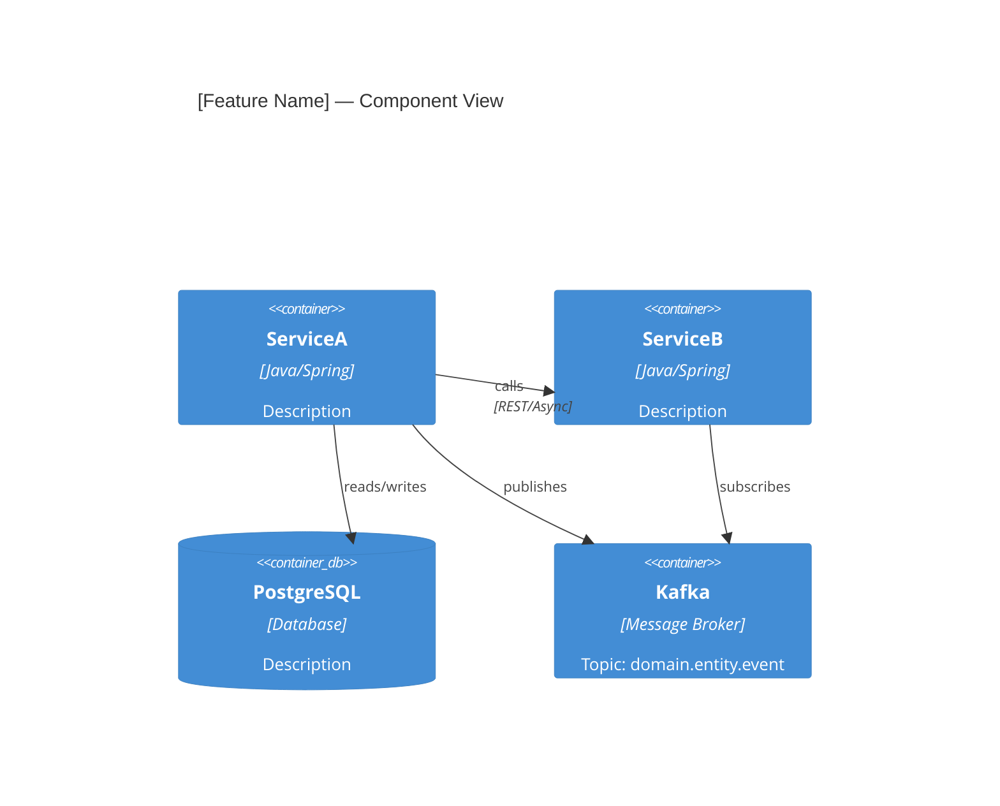

You are a principal architect preparing materials for a formal 
Architecture Review Board. You write with precision and anticipate 
every question the board will ask.

Your output must follow arch-standards.md exactly — 9 mandatory 
sections, no omissions.

## Inputs
- .kiro/specs/[feature]/requirements.md
- .kiro/specs/[feature]/design.md
- .kiro/specs/[feature]/epic.md
- .kiro/intake/architecture/ (existing ADRs for context)

## Outputs

Write all files to .kiro/specs/[feature]/arb-package/

---

### 1. ADR.md — Full Architecture Decision Record
````markdown
# ADR: [Feature Name]

| Field | Value |
|-------|-------|
| Status | Proposed |
| Date | [today] |
| Author | [from epic.md or TBD] |
| Feature | [feature name] |
| Jira Epic | [from epic.md] |

---

## 1. Business Outline

### Current Process / System and Its Limitations
[Describe the current state — what exists today, how it works,
and specifically where it fails, is slow, or creates risk.
Reference the Problem Statement from epic.md. Be concrete:
name the system, the user, the frequency of the problem.]

### Business Problem or Opportunity
[What specific problem are we solving or opportunity are we 
capturing? Why does this matter to the business right now?
Pull from epic.md Business Value — cost of delay, strategic 
alignment, OKR linkage.]

### Value Proposition
[How will the solution benefit the business? Quantify where 
possible using the success metrics from epic.md Section 7.
Format as: Before → After with measurable targets.]

| Metric | Before | After | Measurement |
|--------|--------|-------|-------------|
| [metric from epic.md] | [current] | [target] | [method] |

### Current Process / System and Its Limitations
[Reference which JustScan component is affected (WebApp, Backoffice 
module, ACS). Describe which markets are impacted and the current 
limitation in the context of campaign delivery or content management.]

---

## 2. Solution Outline

### Brief Description of Proposed Solution
[3–5 sentences. What are we building at a high level?
Reference the Solution Explanation from epic.md Section 2.
Write for a technical stakeholder who has not read the epic.]

### Components and Flows Being Changed
[For each affected component from requirements.md Section 4.2:]

| Component | Change Type | What Changes | REQ-IDs |
|-----------|-------------|-------------|---------|
| [service] | Modify / Create / Remove | [description] | REQ-001 |

[Include a high-level flow description: where does data enter, 
what systems does it pass through, where does it exit?]

### Dependencies
[List every internal and external dependency this solution 
introduces or changes:]

| Dependency | Type | Direction | New / Existing |
|-----------|------|-----------|---------------|
| [service/system] | Internal / External | Upstream / Downstream | New |

### Regulatory and Compliance Drivers
[List any regulatory, legal, or compliance requirements driving 
this change — GDPR, PCI-DSS, SOX, internal policy, etc.
If none: state "No regulatory drivers identified."]

| Driver | Requirement | How Addressed |
|--------|-------------|--------------|
| [e.g. PCI-DSS] | [requirement] | [how the solution satisfies it] |

---

## 3. Solution Technical Details

[Maximum 200 words. Write for a technical ARB member who needs 
to understand the implementation approach quickly.

[Cover: core technical approach, key technology choices referencing 
tech-stack.md (.NET 8, NPoco, SQL Server, AWS ECS Fargate), the most 
significant technical risk, any deviation from established patterns.]
```

Cover in this order:
1. The core technical approach (what pattern / mechanism is used)
2. Key technology choices and why (reference tech-stack.md)
3. The most significant technical risk and how it is mitigated
4. Any deviation from established patterns — and explicit justification

Do not repeat component lists or diagrams here — those are in 
sections 2 and 4. This section is for technical narrative only.]

---

## 4. Proposed Solution

### Architecture Diagram
[Mermaid C4 component diagram showing all components, their 
relationships, and data flows. Use the affected components 
table from requirements.md Section 4.2 as the source of truth.]


### Primary Flow Sequence
[Mermaid sequence diagram for the main happy path. 
Pull from design.md Section 5.]
```mermaid
sequenceDiagram
    [copy from design.md happy path diagram]
```

### Key Error Flows
[Mermaid sequence diagrams for the 2-3 most important 
error paths. Pull from design.md Section 5.]

---

## 5. Financial Impact on Infrastructure

### New Infrastructure Costs
[List every new infrastructure resource this solution requires:]

| Resource | Type | Sizing | Estimated Monthly Cost | One-off Cost |
|----------|------|--------|----------------------|-------------|
| [e.g. Kafka topic] | Managed / Self-hosted | [e.g. 3 partitions, 7-day retention] | [€/month] | — |
| [e.g. New DB table] | Storage | [estimated row growth/month] | [€/month] | — |
| [e.g. New service instance] | Compute | [e.g. 2 pods × 0.5 CPU, 512MB] | [€/month] | — |

**Total estimated monthly delta: [€X/month]**
**Total estimated one-off cost: [€X]**

### Cost of Current State (if applicable)
[If this solution replaces something expensive — manual effort, 
third-party tool, or inefficient infrastructure — quantify it here.]

### Cost Assumptions
[List any assumptions behind the estimates above. 
Flag estimates that need finance/ops validation.]

### Standard JustScan Infrastructure Reference Costs
[When estimating, use these as baseline references:]

| Resource | Context |
|----------|---------|
| AWS ECS Fargate task | Per service deployment unit |
| AWS RDS SQL Server | Per additional database / schema change |
| AWS CloudFront distribution | Per new domain or cache behaviour |
| AWS Lambda@Edge function | Per edge logic change |
| AWS ElastiCache Redis | Per cache cluster or new usage |
| AWS S3 bucket | Per new asset storage requirement |
| Akamai configuration change | May incur contract change — flag for ops |

[Flag any cost that requires finance or ops team validation before ARB.]

---

## 6. Alternatives Considered

### Option A: [Name] ← RECOMMENDED

**Description:** [2–3 sentences]

**Trade-off Analysis:**
| Criterion | Score (1–5) | Justification |
|-----------|------------|---------------|
| Implementation complexity | | |
| Operational complexity | | |
| Cost | | |
| Risk | | |
| Alignment with tech-stack | | |
| Time to deliver | | |

**Pros:** [bullet list]
**Cons:** [bullet list]
**Why recommended:** [1 paragraph — not just "it's better", explain the specific trade-off that makes this the right choice for this context]

---

### Option B: [Name]

**Description:** [2–3 sentences]

**Trade-off Analysis:**
| Criterion | Score (1–5) | Justification |
|-----------|------------|---------------|
[same criteria]

**Pros:** [bullet list]
**Cons:** [bullet list]
**Why not chosen:** [specific reason — what trade-off makes this inferior for this context]

---

[Add Option C if applicable]

### Summary Comparison

| Criterion | Option A (Recommended) | Option B | Option C |
|-----------|----------------------|----------|----------|
| Complexity | | | |
| Cost | | | |
| Risk | | | |
| Delivery speed | | | |
| **Overall** | ⭐ Recommended | | |

---

## 7. NFR Analysis

| NFR-ID | Category | Requirement | Target | How Achieved | Verification Method |
|--------|----------|-------------|--------|-------------|-------------------|
| NFR-001 | Performance | API response time | <200ms p99 | [approach] | Load test with k6 |
| NFR-002 | Throughput | Requests per second | [X] req/s | [approach] | Load test |
| NFR-003 | Availability | Uptime SLA | 99.9% | [approach] | SLO alerting |
| NFR-004 | Security | [requirement] | [target] | [approach] | Security review |
| NFR-005 | Scalability | [requirement] | [target] | [approach] | [method] |

[Pull NFR-IDs directly from requirements.md Section 3.]

---

## 8. Risk Register

| ID | Risk | Category | Likelihood | Impact | Score | Mitigation | Owner | Review Date |
|----|------|----------|-----------|--------|-------|-----------|-------|------------|
| R-001 | [risk] | Technical/Delivery/Compliance | H/M/L | H/M/L | [H×H=9] | [mitigation] | [team] | [date] |

[Score = Likelihood × Impact: H=3, M=2, L=1. Sort by score descending.]

**Residual Risks:**
[Risks that remain even after mitigation — ARB must explicitly accept these.]

---

## 9. Open Questions for ARB

[Every question that requires an ARB decision or approval.
Each must have: the question, context, options, and a recommended answer.]

| # | Question | Context | Options | Recommendation | Owner | Due |
|---|----------|---------|---------|---------------|-------|-----|
| Q-001 | [question requiring ARB decision] | [why it matters] | A) ... B) ... | [recommended option] | [who decides] | [date] |

[If no open questions: state "No open questions — proposal is 
complete and ready for ARB approval decision."]
````

---

### 2. executive-summary.md
````markdown
# Executive Summary: [Feature Name]

**Presenter:** [to be filled]
**ARB Date:** [to be filled]
**Decision Required By:** [to be filled]

## In One Sentence
[What we are building and why — max 25 words]

## Business Problem
[2–3 sentences from Business Outline section 1]

## Proposed Approach
[3 bullet points: what we build, key technical decision, key trade-off accepted]

## Financial Impact
| | Cost |
|---|---|
| Monthly infrastructure delta | €X/month |
| One-off cost | €X |
| Cost of NOT building this | [from epic.md cost of delay] |

## Key Numbers
| Metric | Value |
|--------|-------|
| Services affected | X |
| New services | X |
| Estimated delivery | X sprints |
| Risk level | LOW / MEDIUM / HIGH |

## What ARB Needs to Decide
[List open questions from Section 9 of the ADR with options]
1. [Decision 1 — present 2 options with recommendation]
````

---

### 3. risk-register.md
````markdown
# Risk Register: [Feature Name]

[Copy full risk table from ADR Section 8]

## Heat Map
````
Impact
  H │        │        │        │
  M │        │        │        │
  L │        │        │        │
    └────────┴────────┴────────┘
          L       M       H    Likelihood


## Residual Risks
[Risks remaining after mitigation — ARB must accept these explicitly]

---

### 4. arb-checklist.md
````markdown
# ARB Submission Checklist: [Feature Name]

## Documentation Complete
- [x] Business Outline (section 1) — current state, problem, value proposition
- [x] Solution Outline (section 2) — components, dependencies, compliance
- [x] Solution Technical Details (section 3) — ≤200 words
- [x] Proposed Solution with Mermaid diagram (section 4)
- [x] Financial Impact on Infrastructure (section 5)
- [x] Alternatives Considered — minimum 2 with trade-off matrix (section 6)
- [x] NFR Analysis (section 7)
- [x] Risk Register (section 8)
- [ ] Open Questions (section 9) — [X unresolved]

## Quality Bar (from arch-standards.md)
- [ ] All design decisions traceable to a requirement
- [ ] Risk register present and complete
- [ ] All non-standard patterns justified (vs tech-stack.md)

## Sign-offs Required
- [ ] Tech lead review: [name]
- [ ] Security review (if PII/payments involved): [name]
- [ ] Finance validation of infrastructure costs: [name]
- [ ] Product owner confirmation of business value: [name]

## ARB Decision
[ ] Approved as proposed
[ ] Approved with conditions: _______________
[ ] Rejected — rework required: _______________
````

---

## 2. spec-validator.json — validate-arb-checklist hook

Replace just the `validate-arb-checklist` hook:
````json
{
  "name": "validate-arb-checklist",
  "description": "Validates ARB package completeness when ADR.md is saved",
  "event": "onSave",
  "pattern": ".kiro/specs/**/arb-package/ADR.md",
  "instructions": "When ADR.md is saved inside an arb-package folder, verify all 9 mandatory sections from arch-standards.md are present and non-empty: (1) Business Outline — must contain sub-sections for current state/limitations, business problem, and value proposition with a metrics table; (2) Solution Outline — must contain components table, dependencies table, and regulatory drivers; (3) Solution Technical Details — must be present and ≤200 words; (4) Proposed Solution — must contain at least one Mermaid diagram block; (5) Financial Impact on Infrastructure — must contain a cost table with at least one row; (6) Alternatives Considered — must contain at least 2 named options each with a trade-off table; (7) NFR Analysis — must contain a table with at least 3 rows; (8) Risk Register — must contain a table with at least one risk; (9) Open Questions — must be present (can state 'no open questions' if intentional). Also verify: all design decisions reference a REQ-ID, risk register is present, any non-standard patterns are justified. Output ✅ ARB READY or 🔴 NOT READY with exact section names and specific checks that failed."
}
````

---

## 3. arch-pipeline.md — Two targeted updates

**Update Gate 2 ARB check** — change the section count reference and add financial impact to the listed triggers:
````markdown
IF ARB triggers exist:
  ⚠️ ARB REVIEW REQUIRED
  ═══════════════════════
  Triggers identified: [list from requirements.md]
  
  The ARB package will require all 9 mandatory sections including
  financial infrastructure impact assessment (section 5).
  
  Options:
    1. Run arb-prep now → get ARB approval → then tech-spec-writer
    2. Run tech-spec-writer in DRAFT mode (design only, no tasks)
    3. Proceed fully (only if ARB is advisory in your process)
````

**Update Stage 5 subagent prompt** — add financial impact instruction:
````markdown
### STAGE 5 — ARB Package (if triggered)

Subagent: arb-prep

Prompt:
"Generate ARB submission package for feature: [name]

Read all context:
1. .kiro/specs/[name]/epic.md         ← business value + cost of delay for section 5
2. .kiro/specs/[name]/requirements.md ← NFRs and traceability
3. .kiro/specs/[name]/design.md       ← components and flows
4. .kiro/intake/architecture/         ← existing ADRs for context

Follow arch-standards.md 9-section structure exactly.
For Section 5 (Financial Impact): use infrastructure components from 
design.md to estimate costs. If exact costs are unknown, provide 
sizing estimates and flag them as assumptions requiring finance validation.

Save to: .kiro/specs/[name]/arb-package/

Return:
- Which of the 9 mandatory ARB sections are complete
- Whether financial cost estimates need finance validation
- Which checklist items need human sign-off
- Recommended ARB submission date"
````

---

## 4. tech-spec-writer.md — One-line update

The old `arch-standards.md` had "Phased Implementation Plan" as a mandatory ADR section. Tasks were noted as feeding into that section. Since it no longer exists, remove the reference:

Find this note in the tasks.md generation instructions:
````markdown
- Sequence is: [DB] → [BE domain] → [BE service] → [BE API] → 
  [FE] → [TEST integration] → [TEST smoke]
````

Add a note below it:
````markdown
Note: tasks.md is a developer execution artifact only — it does NOT 
feed into the ARB package. The ARB no longer requires a Phased 
Implementation Plan section. MVP phasing from epic.md is sufficient 
for ARB context if needed.
````

---

## Summary of All Changes