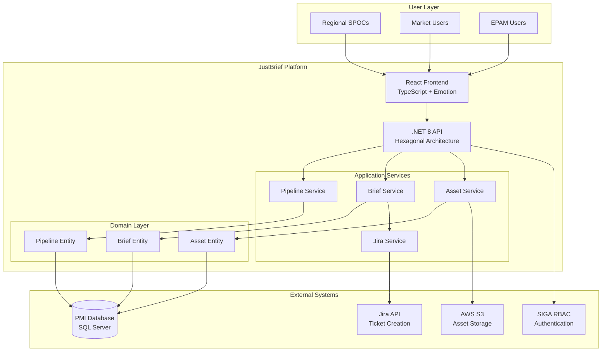

# Architecture Decision Record: JustBrief Platform

**ADR ID:** ADR-2026-001  
**Title:** JustBrief Campaign Briefing Platform Implementation  
**Date:** 20 March 2026  
**Status:** Proposed  
**Epic:** JSN-11995

---

## 1. Business Outline

### Current Process Limitations
The current campaign submission process is highly fragmented, relying on multiple disconnected tools including PowerPoint presentations, PDF documents, Jira tickets, emails, Microsoft Teams messages, and shared files. This fragmentation creates several operational issues:

- Campaign information is often incomplete or inconsistent
- Multiple clarification cycles required between markets and EPAM
- No clear traceability between campaign pipeline and Jira tickets
- Campaign requests are difficult to track and manage
- Manual coordination required between multiple stakeholders

### Business Problem
The time required to move from campaign idea to execution is unnecessarily long, inefficient, and difficult to manage at scale. Markets struggle with inconsistent submission processes, while EPAM teams face incomplete briefs requiring multiple clarification rounds.

### Value Proposition
JustBrief will reduce brief submission time from several days to approximately 30 minutes while ensuring complete, standardized submissions with automatic Jira integration and full traceability from pipeline to execution.

---

## 2. Solution Outline

### Proposed Solution
JustBrief is an all-in-one campaign briefing and pipeline management platform that centralizes the entire submission process. The solution provides:

- Centralized pipeline management for Regional SPOCs and EPAM
- Market-specific campaign visibility and selection
- Structured briefing interface with validation
- Asset upload and metadata management
- Visual campaign flow definition
- Automatic Jira ticket creation and EPAM notifications

### Components Being Changed
- **New Service:** JustBrief platform (backend API + frontend)
- **Database:** New tables in PMI database infrastructure
- **Integration:** SIGA RBAC system for authentication
- **Integration:** Jira API for automated ticket creation
- **Storage:** AWS S3 for campaign asset storage

### Dependencies
- **SIGA RBAC System:** User authentication and role management
- **PMI Database Infrastructure:** Data storage and persistence
- **Jira API:** Automated ticket creation and notifications
- **AWS S3:** Asset storage and retrieval
- **JustScan Platform:** Integration into existing ecosystem

### Regulatory/Compliance Drivers
- PMI data governance policies for campaign data storage
- GDPR compliance for asset uploads containing potential PII
- Security requirements for SIGA integration
- Audit trail requirements for campaign traceability

---

## 3. Solution Technical Details

JustBrief implements hexagonal architecture with .NET 8 backend and React 18 frontend. Core components include Pipeline Service (campaign management), Brief Service (submission workflow), Asset Service (S3 integration), and Jira Integration Service (automated ticketing). 

Authentication via SIGA RBAC ensures role-based access control with market-specific data isolation. All structured data persists in PMI database infrastructure while assets store in AWS S3. The system provides real-time validation, draft saving, and comprehensive audit trails.

Key technical patterns: NPoco ORM for database access, AutoMapper for DTOs, Serilog for structured logging, and OpenAPI specifications for all REST endpoints. Frontend uses TypeScript with Emotion for styling and XState for complex workflow management.

---

## 4. Proposed Solution Architecture

---

## 5. Financial Impact on Infrastructure

### New Infrastructure Costs

**Compute Resources:**
- ECS Fargate tasks: 2 tasks (API + Frontend) × $50/month = $100/month
- Load balancer: $25/month
- **Subtotal Compute:** $125/month

**Storage Costs:**
- RDS SQL Server storage: 100GB × $0.115/GB = $11.50/month
- S3 asset storage: 500GB × $0.023/GB = $11.50/month
- S3 requests: ~10,000 requests × $0.0004 = $4/month
- **Subtotal Storage:** $27/month

**Data Transfer:**
- CloudFront distribution: ~100GB × $0.085/GB = $8.50/month
- **Subtotal Transfer:** $8.50/month

**Third-Party Integrations:**
- Jira API calls: Included in existing license
- SIGA integration: No additional cost
- **Subtotal Integrations:** $0/month

**Total Monthly Cost:** $160.50/month  
**Total Annual Cost:** $1,926/year

### Cost Savings

**Operational Efficiency:**
- Reduced manual coordination: 20 hours/month × $50/hour = $1,000/month
- Faster brief processing: 40 hours/month × $50/hour = $2,000/month
- **Total Monthly Savings:** $3,000/month

**Net Financial Impact:** +$2,839.50/month savings  
**ROI:** 1,769% annually

---

## 6. Alternatives Considered

### Alternative 1: Extend Existing JustScan Backoffice

**Pros:**
- Reuse existing infrastructure and authentication
- Faster development timeline (4-6 weeks)
- Lower infrastructure costs

**Cons:**
- Couples briefing functionality with campaign management
- Limited flexibility for briefing-specific workflows
- Potential performance impact on existing backoffice users
- Harder to maintain separate access controls

**Trade-off Analysis:**
| Criteria | Weight | JustBrief (Standalone) | Extended Backoffice |
|----------|--------|----------------------|-------------------|
| Maintainability | 25% | 9 | 6 |
| Performance | 20% | 9 | 7 |
| Flexibility | 20% | 9 | 5 |
| Development Speed | 15% | 6 | 9 |
| Infrastructure Cost | 10% | 7 | 9 |
| User Experience | 10% | 9 | 6 |
| **Weighted Score** | | **8.1** | **6.7** |

### Alternative 2: Third-Party Solution (e.g., Monday.com, Asana)

**Pros:**
- No development effort required
- Proven workflow management capabilities
- Built-in collaboration features

**Cons:**
- No SIGA integration capability
- Cannot integrate with PMI database infrastructure
- Limited customization for campaign-specific workflows
- Ongoing licensing costs ($15-25/user/month)
- Data sovereignty concerns

**Trade-off Analysis:**
| Criteria | Weight | JustBrief (Standalone) | Third-Party Solution |
|----------|--------|----------------------|-------------------|
| Integration Capability | 30% | 9 | 3 |
| Customization | 25% | 9 | 4 |
| Data Control | 20% | 9 | 2 |
| Development Effort | 15% | 6 | 10 |
| Ongoing Costs | 10% | 8 | 5 |
| **Weighted Score** | | **8.2** | **4.6** |

**Recommendation:** Standalone JustBrief platform provides the best balance of functionality, integration capability, and long-term maintainability.

---

## 7. NFR Analysis

### Latency Requirements
- **API Response Time:** < 1 second for 95th percentile
- **Page Load Time:** < 3 seconds for initial load
- **Asset Upload:** Progress indication for files > 10MB
- **Search/Filter Operations:** < 2 seconds

**Mitigation Strategies:**
- Database indexing on frequently queried columns
- CDN for static assets via CloudFront
- Lazy loading for large datasets
- Async processing for asset uploads

### Throughput Requirements
- **Concurrent Users:** Support 50 simultaneous users
- **Peak Load:** 200 brief submissions per day
- **Asset Uploads:** 10 concurrent uploads of 100MB each
- **API Requests:** 1,000 requests per minute

**Scaling Strategy:**
- Horizontal scaling via ECS Fargate auto-scaling
- Database connection pooling
- S3 multipart uploads for large files
- Rate limiting to prevent abuse

### Availability Requirements
- **Uptime SLA:** 99.5% during business hours (8 AM - 6 PM CET)
- **Planned Maintenance:** Outside business hours only
- **Recovery Time:** < 15 minutes for service restoration
- **Data Backup:** Daily automated backups with 30-day retention

**High Availability Design:**
- Multi-AZ RDS deployment
- ECS service across multiple availability zones
- Health checks and automatic failover
- Circuit breaker pattern for external integrations

### Security Requirements
- **Authentication:** SIGA RBAC integration with JWT tokens
- **Authorization:** Role-based access control with market isolation
- **Data Encryption:** TLS 1.3 in transit, AES-256 at rest
- **Audit Logging:** Complete audit trail for all operations
- **Input Validation:** Comprehensive validation and sanitization

**Security Controls:**
- AWS WAF for API protection
- Secrets Manager for credential management
- Regular security scanning and penetration testing
- GDPR compliance for asset uploads

---

## 8. Risk Register

| Risk | Likelihood | Impact | Risk Score | Mitigation Strategy |
|------|------------|--------|------------|-------------------|
| SIGA Integration Complexity | Medium (60%) | High (8) | 4.8 | Early technical spike, fallback authentication |
| Jira API Rate Limiting | Low (20%) | Medium (6) | 1.2 | Request batching, retry logic, SLA agreement |
| Asset Upload Performance | Medium (40%) | Medium (6) | 2.4 | Multipart uploads, progress indication, size limits |
| User Adoption Resistance | High (70%) | Medium (5) | 3.5 | Training program, gradual rollout, user feedback |
| PMI Database Schema Changes | Low (30%) | High (7) | 2.1 | Database migration strategy, backward compatibility |
| S3 Storage Costs Escalation | Medium (50%) | Low (3) | 1.5 | Storage lifecycle policies, compression, monitoring |
| GDPR Compliance Issues | Low (20%) | High (9) | 1.8 | Legal review, data classification, privacy controls |

**Risk Mitigation Priority:**
1. **High Priority:** SIGA Integration (4.8), User Adoption (3.5)
2. **Medium Priority:** Asset Performance (2.4), Database Changes (2.1)
3. **Low Priority:** GDPR Compliance (1.8), Storage Costs (1.5), Jira Rate Limits (1.2)

---

## 9. Open Questions Requiring ARB Decision

### Question 1: SIGA Integration Scope
**Question:** Should JustBrief implement full SIGA role synchronization or use a simplified role mapping?  
**Options:**
- A) Full synchronization with real-time role updates
- B) Simplified mapping with periodic sync (daily)
- C) Hybrid approach with critical roles real-time, others periodic

**Recommendation:** Option C - Hybrid approach balances performance with security requirements

### Question 2: Asset Storage Strategy
**Question:** Should campaign assets be stored in dedicated S3 bucket or shared JustScan bucket?  
**Options:**
- A) Dedicated JustBrief S3 bucket with separate lifecycle policies
- B) Shared JustScan bucket with JustBrief prefix
- C) Market-specific buckets for data sovereignty

**Recommendation:** Option A - Dedicated bucket provides better isolation and cost management

### Question 3: Jira Integration Depth
**Question:** Should JustBrief implement bidirectional Jira sync or one-way ticket creation?  
**Options:**
- A) One-way: JustBrief → Jira ticket creation only
- B) Bidirectional: Sync status updates from Jira back to JustBrief
- C) Full integration: Comments, attachments, workflow sync

**Recommendation:** Option B - Bidirectional status sync provides value without excessive complexity

### Question 4: Multi-Tenancy Strategy
**Question:** How should market data isolation be implemented?  
**Options:**
- A) Database-level isolation with separate schemas per market
- B) Application-level isolation with market filtering
- C) Hybrid with sensitive data in separate schemas

**Recommendation:** Option B - Application-level isolation is sufficient for current requirements

### Question 5: Performance Monitoring
**Question:** What level of performance monitoring should be implemented?  
**Options:**
- A) Basic: New Relic APM + standard metrics
- B) Enhanced: Custom metrics + user experience monitoring
- C) Comprehensive: Full observability stack with distributed tracing

**Recommendation:** Option B - Enhanced monitoring provides good visibility without excessive overhead

---

## ARB Decision Required By: 15 April 2026  
**Recommended ARB Meeting Date:** 10 April 2026