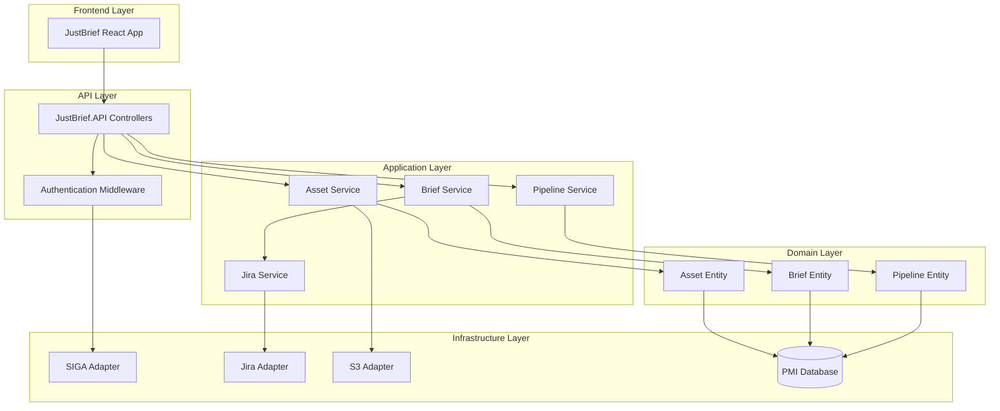
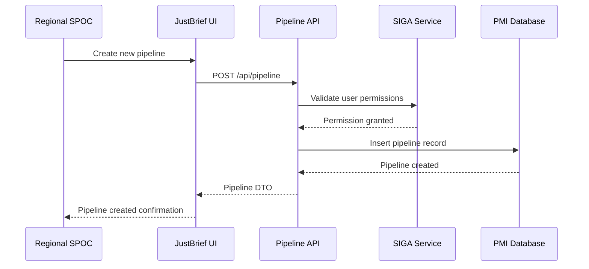
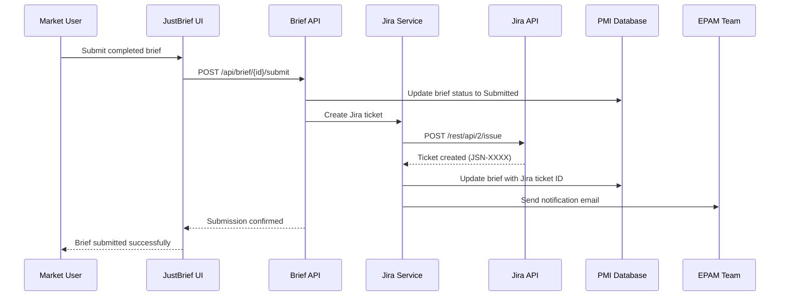
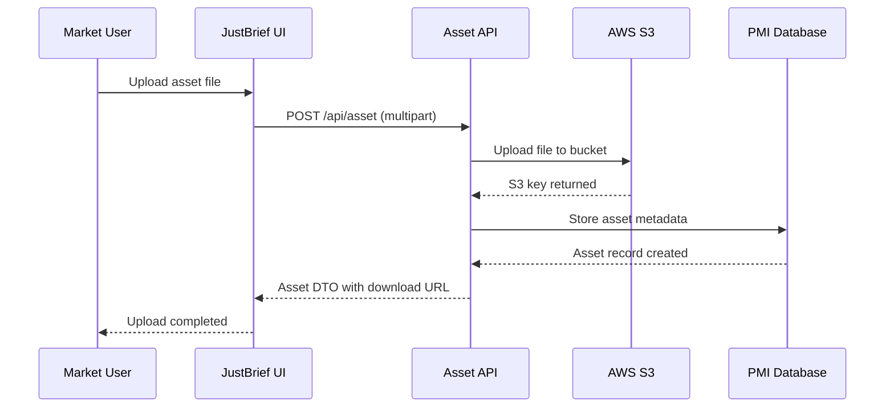

# Technical Design: JustBrief

**Feature:** JustBrief Campaign Briefing Platform  
**Epic:** JSN-11995  
**Date:** 20 March 2026  
**Architecture:** Hexagonal (Ports & Adapters)

---

## 1. System Architecture Overview

JustBrief will be implemented as a new module within the existing JustScan platform, following the established hexagonal architecture pattern. The system consists of:

- **JustBrief.API** - REST API backend (.NET 8)
- **JustBrief.Frontend** - React 18 + TypeScript frontend
- **JustBrief.Domain** - Core business logic and entities
- **JustBrief.Infrastructure** - External integrations (SIGA, Jira, S3)

### 1.1 High-Level Architecture


## 2. Component Design

### 2.1 Backend Components

#### JustBrief.API.Controllers

**PipelineController**
```csharp
[ApiController]
[Route("api/[controller]")]
public class PipelineController : ControllerBase
{
    public async Task<ActionResult<IEnumerable<PipelineDto>>> GetPipelines([FromQuery] PipelineFilter filter)
    public async Task<ActionResult<PipelineDto>> CreatePipeline([FromBody] CreatePipelineRequest request)
    public async Task<ActionResult<PipelineDto>> UpdatePipelineStatus(int id, [FromBody] UpdateStatusRequest request)
    public async Task<ActionResult<byte[]>> ExportPipelinesCsv([FromQuery] PipelineFilter filter)
}
```

**BriefController**
```csharp
[ApiController]
[Route("api/[controller]")]
public class BriefController : ControllerBase
{
    public async Task<ActionResult<BriefDto>> GetBrief(int briefId)
    public async Task<ActionResult<BriefDto>> CreateBrief([FromBody] CreateBriefRequest request)
    public async Task<ActionResult<BriefDto>> UpdateBrief(int id, [FromBody] UpdateBriefRequest request)
    public async Task<ActionResult<BriefDto>> SubmitBrief(int id)
}
```

**AssetController**
```csharp
[ApiController]
[Route("api/[controller]")]
public class AssetController : ControllerBase
{
    public async Task<ActionResult<AssetDto>> UploadAsset([FromForm] IFormFile file, [FromForm] AssetMetadata metadata)
    public async Task<ActionResult<Stream>> DownloadAsset(int assetId)
    public async Task<ActionResult<IEnumerable<AssetDto>>> GetBriefAssets(int briefId)
}
```

#### JustBrief.Application.Services

**IPipelineService**
```csharp
public interface IPipelineService
{
    Task<IEnumerable<Pipeline>> GetPipelinesForUser(string userId, PipelineFilter filter);
    Task<Pipeline> CreatePipeline(CreatePipelineCommand command);
    Task<Pipeline> UpdatePipelineStatus(int pipelineId, PipelineStatus status);
    Task<byte[]> ExportPipelinesCsv(PipelineFilter filter);
}
```

**IBriefService**
```csharp
public interface IBriefService
{
    Task<Brief> CreateBrief(CreateBriefCommand command);
    Task<Brief> UpdateBrief(UpdateBriefCommand command);
    Task<Brief> SubmitBrief(int briefId);
    Task<IEnumerable<Brief>> GetBriefsForUser(string userId);
}
```

**IAssetService**
```csharp
public interface IAssetService
{
    Task<Asset> UploadAsset(UploadAssetCommand command);
    Task<Stream> GetAssetStream(int assetId);
    Task<IEnumerable<Asset>> GetBriefAssets(int briefId);
}
```

**IJiraIntegrationService**
```csharp
public interface IJiraIntegrationService
{
    Task<string> CreateTicketFromBrief(Brief brief);
    Task NotifyEpamTeam(string ticketId, Brief brief);
}
```
### 2.2 Domain Entities

**Pipeline Entity**
```csharp
public class Pipeline
{
    public int Id { get; set; }
    public string Name { get; set; }
    public string Description { get; set; }
    public PipelineStatus Status { get; set; }
    public DateTime CreatedDate { get; set; }
    public DateTime? StartDate { get; set; }
    public DateTime? EndDate { get; set; }
    public string CreatedBy { get; set; }
    public List<string> AssignedMarkets { get; set; }
    public CampaignType CampaignType { get; set; }
}

public enum PipelineStatus
{
    Draft,
    Active,
    Cancelled,
    Completed
}
```

**Brief Entity**
```csharp
public class Brief
{
    public int Id { get; set; }
    public int PipelineId { get; set; }
    public string MarketCode { get; set; }
    public string SubmittedBy { get; set; }
    public BriefStatus Status { get; set; }
    public DateTime CreatedDate { get; set; }
    public DateTime? SubmittedDate { get; set; }
    public string JiraTicketId { get; set; }
    public BriefContent Content { get; set; }
    public CampaignFlow Flow { get; set; }
    public List<Asset> Assets { get; set; }
}

public enum BriefStatus
{
    Draft,
    Submitted,
    UnderReview,
    Approved,
    Rejected
}
```

**Asset Entity**
```csharp
public class Asset
{
    public int Id { get; set; }
    public int BriefId { get; set; }
    public string FileName { get; set; }
    public string S3Key { get; set; }
    public long FileSizeBytes { get; set; }
    public string ContentType { get; set; }
    public AssetMetadata Metadata { get; set; }
    public DateTime UploadedDate { get; set; }
    public string UploadedBy { get; set; }
}

public class AssetMetadata
{
    public string Description { get; set; }
    public string UsageContext { get; set; }
    public Dictionary<string, string> CustomProperties { get; set; }
}
```
## 3. Database Design

### 3.1 Entity Changes

**New Tables:**

```sql
-- Pipelines table
CREATE TABLE JustBrief_Pipelines (
    Id INT IDENTITY(1,1) PRIMARY KEY,
    Name NVARCHAR(255) NOT NULL,
    Description NVARCHAR(MAX),
    Status INT NOT NULL, -- PipelineStatus enum
    CreatedDate DATETIME2 NOT NULL DEFAULT GETUTCDATE(),
    StartDate DATETIME2 NULL,
    EndDate DATETIME2 NULL,
    CreatedBy NVARCHAR(255) NOT NULL,
    AssignedMarkets NVARCHAR(MAX), -- JSON array
    CampaignType INT NOT NULL,
    INDEX IX_Pipelines_Status (Status),
    INDEX IX_Pipelines_CreatedBy (CreatedBy)
);

-- Briefs table
CREATE TABLE JustBrief_Briefs (
    Id INT IDENTITY(1,1) PRIMARY KEY,
    PipelineId INT NOT NULL,
    MarketCode NVARCHAR(10) NOT NULL,
    SubmittedBy NVARCHAR(255) NOT NULL,
    Status INT NOT NULL, -- BriefStatus enum
    CreatedDate DATETIME2 NOT NULL DEFAULT GETUTCDATE(),
    SubmittedDate DATETIME2 NULL,
    JiraTicketId NVARCHAR(50) NULL,
    Content NVARCHAR(MAX), -- JSON
    Flow NVARCHAR(MAX), -- JSON
    FOREIGN KEY (PipelineId) REFERENCES JustBrief_Pipelines(Id),
    INDEX IX_Briefs_Pipeline (PipelineId),
    INDEX IX_Briefs_Market (MarketCode),
    INDEX IX_Briefs_Status (Status)
);

-- Assets table
CREATE TABLE JustBrief_Assets (
    Id INT IDENTITY(1,1) PRIMARY KEY,
    BriefId INT NOT NULL,
    FileName NVARCHAR(255) NOT NULL,
    S3Key NVARCHAR(500) NOT NULL,
    FileSizeBytes BIGINT NOT NULL,
    ContentType NVARCHAR(100) NOT NULL,
    Metadata NVARCHAR(MAX), -- JSON
    UploadedDate DATETIME2 NOT NULL DEFAULT GETUTCDATE(),
    UploadedBy NVARCHAR(255) NOT NULL,
    FOREIGN KEY (BriefId) REFERENCES JustBrief_Briefs(Id),
    INDEX IX_Assets_Brief (BriefId)
);
```

### 3.2 Migration Scripts

**Migration: 20260320_001_CreateJustBriefTables.sql**
- Creates all JustBrief tables with proper indexes
- Adds foreign key constraints
- Sets up initial data types and constraints
## 4. Key Flows & Sequence Diagrams

### 4.1 Pipeline Creation Flow



### 4.2 Brief Submission & Jira Integration Flow



### 4.3 Asset Upload Flow


## 5. Frontend Architecture

### 5.1 React Component Structure

```
src/
├── components/
│   ├── Pipeline/
│   │   ├── PipelineList.tsx
│   │   ├── PipelineCard.tsx
│   │   └── CreatePipelineModal.tsx
│   ├── Brief/
│   │   ├── BriefForm.tsx
│   │   ├── BriefSummary.tsx
│   │   └── BriefSubmission.tsx
│   ├── Assets/
│   │   ├── AssetUpload.tsx
│   │   ├── AssetList.tsx
│   │   └── AssetMetadataForm.tsx
│   └── Flow/
│       ├── FlowBuilder.tsx
│       ├── FlowNode.tsx
│       └── FlowCanvas.tsx
├── services/
│   ├── pipelineService.ts
│   ├── briefService.ts
│   └── assetService.ts
├── hooks/
│   ├── usePipelines.ts
│   ├── useBriefs.ts
│   └── useAssets.ts
└── types/
    ├── pipeline.ts
    ├── brief.ts
    └── asset.ts
```

### 5.2 State Management

Using React Context + useReducer for global state:

```typescript
interface JustBriefState {
  user: UserProfile;
  pipelines: Pipeline[];
  currentBrief: Brief | null;
  assets: Asset[];
  loading: boolean;
  error: string | null;
}

const JustBriefContext = createContext<{
  state: JustBriefState;
  dispatch: Dispatch<JustBriefAction>;
}>();
```

## 6. Integration Design

### 6.1 SIGA Integration

**SigaAuthenticationService**
```csharp
public interface ISigaAuthenticationService
{
    Task<SigaUserProfile> ValidateToken(string token);
    Task<IEnumerable<string>> GetUserRoles(string userId);
    Task<bool> HasPermission(string userId, string permission);
}
```

**Implementation:**
- JWT token validation via SIGA API
- Role caching with 15-minute TTL
- Fallback to local permissions on SIGA unavailability

### 6.2 Jira Integration

**JiraTicketService**
```csharp
public class JiraTicketService : IJiraIntegrationService
{
    public async Task<string> CreateTicketFromBrief(Brief brief)
    {
        var ticket = new JiraTicket
        {
            Project = "JSN",
            IssueType = "Task",
            Summary = $"Campaign Brief: {brief.Content.CampaignName}",
            Description = BuildTicketDescription(brief),
            Labels = new[] { "justbrief", brief.MarketCode },
            CustomFields = MapBriefToCustomFields(brief)
        };
        
        return await _jiraClient.CreateIssue(ticket);
    }
}
```
## 7. Error Handling & Observability

### 7.1 Error Handling Strategy

**HTTP Status Codes:**
- 200: Success
- 400: Bad Request (validation errors)
- 401: Unauthorized (SIGA authentication failed)
- 403: Forbidden (insufficient permissions)
- 404: Not Found (pipeline/brief not found)
- 409: Conflict (brief already submitted)
- 413: Payload Too Large (asset upload size exceeded)
- 500: Internal Server Error
- 502: Bad Gateway (SIGA/Jira integration failure)

**Exception Types:**
```csharp
public class JustBriefException : Exception
public class ValidationException : JustBriefException
public class AuthorizationException : JustBriefException
public class IntegrationException : JustBriefException
public class AssetUploadException : JustBriefException
```

### 7.2 Logging Strategy

**Structured Logging with Serilog:**
```csharp
Log.Information("Pipeline created {PipelineId} by user {UserId}", 
    pipeline.Id, userId);

Log.Warning("Brief submission failed {BriefId}: {ValidationErrors}", 
    briefId, validationErrors);

Log.Error(ex, "Jira integration failed for brief {BriefId}", briefId);
```

**Log Levels:**
- Information: User actions, successful operations
- Warning: Validation failures, retry attempts
- Error: Integration failures, unhandled exceptions
- Debug: Detailed flow information (dev/staging only)

### 7.3 Metrics & Monitoring

**Custom Metrics:**
- `justbrief_pipeline_created_total`
- `justbrief_brief_submitted_total`
- `justbrief_asset_upload_duration_seconds`
- `justbrief_jira_integration_success_rate`
- `justbrief_siga_auth_duration_seconds`

**Health Checks:**
- Database connectivity
- SIGA API availability
- Jira API availability
- S3 bucket accessibility

**Alerts:**
- Brief submission failure rate > 5%
- SIGA authentication failure rate > 2%
- Jira integration failure rate > 1%
- Asset upload failure rate > 3%

## 8. Security Considerations

### 8.1 Authentication & Authorization

- All API endpoints require valid SIGA JWT token
- Role-based access control enforced at controller level
- Market-specific data isolation via user context
- Asset access controlled by brief ownership

### 8.2 Data Protection

- All API communication over HTTPS/TLS 1.3
- Asset files encrypted at rest in S3
- Database connections encrypted
- PII data handling per GDPR requirements
- Audit logging for all data access

### 8.3 Input Validation

- All user inputs validated and sanitized
- File upload restrictions (type, size, content scanning)
- SQL injection prevention via parameterized queries
- XSS prevention via output encoding