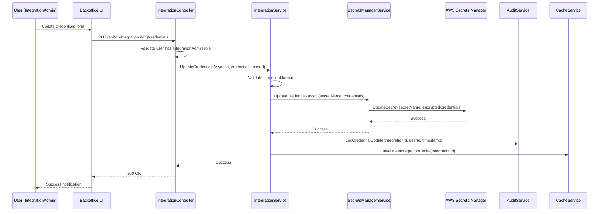
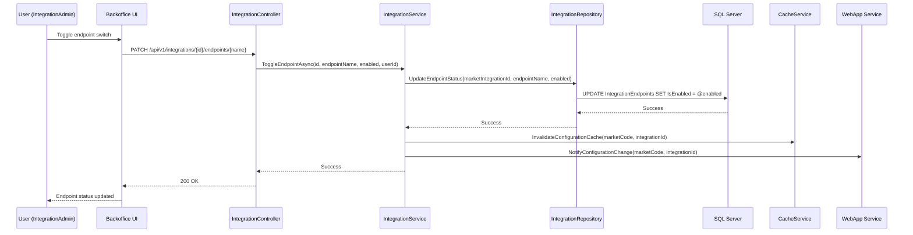
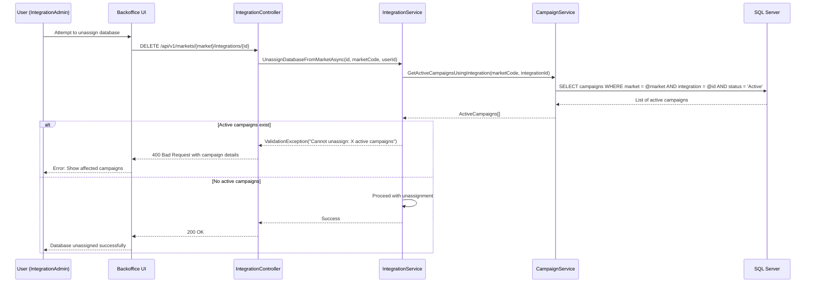

# Technical Design: Integration Configuration Management

**Feature:** Integration Configuration Management  
**Epic ID:** JSN-INTCFG  
**Version:** 1.0  
**Date:** 2024-12-19  
**Status:** DRAFT

---

## 1. Architecture Overview

### 1.1 System Context
This feature adds a new Integration Management module to the existing JustScan Backoffice system. The module enables self-service management of external PMI database integrations without requiring developer intervention.

### 1.2 Design Principles
- Hexagonal architecture for all backend services
- AWS Secrets Manager for credential storage (never plaintext)
- RBAC via Azure EntraID integration
- Audit logging for all configuration changes
- Cache-first approach for configuration reads

---

## 2. Component Design

### 2.1 New Components

#### IntegrationController (API Layer)
```csharp
[ApiController]
[Route("api/v1/integrations")]
[Authorize(Roles = "IntegrationAdmin,IntegrationViewer")]
public class IntegrationController : ControllerBase
{
    [HttpGet]
    public async Task<ActionResult<IntegrationListResponse>> GetIntegrations(
        [FromQuery] string? marketCode = null);
    
    [HttpGet("{integrationId}")]
    public async Task<ActionResult<IntegrationDetailResponse>> GetIntegration(
        Guid integrationId);
    
    [HttpPut("{integrationId}/credentials")]
    [Authorize(Roles = "IntegrationAdmin")]
    public async Task<ActionResult> UpdateCredentials(
        Guid integrationId, 
        [FromBody] UpdateCredentialsRequest request);
    
    [HttpPatch("{integrationId}/endpoints/{endpointName}")]
    [Authorize(Roles = "IntegrationAdmin")]
    public async Task<ActionResult> ToggleEndpoint(
        Guid integrationId, 
        string endpointName, 
        [FromBody] ToggleEndpointRequest request);
}
```
#### IntegrationService (Business Logic)
```csharp
public interface IIntegrationService
{
    Task<IntegrationListDto> GetIntegrationsAsync(string? marketCode = null);
    Task<IntegrationDetailDto> GetIntegrationAsync(Guid integrationId);
    Task UpdateCredentialsAsync(Guid integrationId, CredentialsDto credentials, string userId);
    Task ToggleEndpointAsync(Guid integrationId, string endpointName, bool enabled, string userId);
    Task<bool> TestConnectionAsync(Guid integrationId);
    Task AssignDatabaseToMarketAsync(Guid databaseId, string marketCode, string userId);
    Task UnassignDatabaseFromMarketAsync(Guid databaseId, string marketCode, string userId);
}

public class IntegrationService : IIntegrationService
{
    private readonly IIntegrationRepository _repository;
    private readonly ISecretsManagerService _secretsManager;
    private readonly IAuditService _auditService;
    private readonly ICacheService _cacheService;
    private readonly ICampaignService _campaignService;
}
```

#### SecretsManagerService (Infrastructure)
```csharp
public interface ISecretsManagerService
{
    Task<string> StoreCredentialsAsync(string secretName, object credentials);
    Task<T> RetrieveCredentialsAsync<T>(string secretName);
    Task UpdateCredentialsAsync(string secretName, object credentials);
    Task DeleteCredentialsAsync(string secretName);
    Task<bool> TestConnectionAsync(string secretName, string databaseType);
}

public class SecretsManagerService : ISecretsManagerService
{
    private readonly IAmazonSecretsManager _secretsManager;
    private readonly ILogger<SecretsManagerService> _logger;
}
```

### 2.2 Database Schema Changes

#### New Tables
```sql
-- Integration definitions
CREATE TABLE Integrations (
    Id UNIQUEIDENTIFIER PRIMARY KEY DEFAULT NEWID(),
    Name NVARCHAR(100) NOT NULL,
    DatabaseType NVARCHAR(50) NOT NULL, -- 'PMI_DB_TYPE_A', 'PMI_DB_TYPE_B'
    Description NVARCHAR(500),
    SecretName NVARCHAR(200) NOT NULL, -- AWS Secrets Manager secret name
    IsActive BIT NOT NULL DEFAULT 1,
    CreatedAt DATETIME2 NOT NULL DEFAULT GETUTCDATE(),
    CreatedBy NVARCHAR(100) NOT NULL,
    UpdatedAt DATETIME2 NOT NULL DEFAULT GETUTCDATE(),
    UpdatedBy NVARCHAR(100) NOT NULL,
    CONSTRAINT UK_Integrations_Name UNIQUE (Name),
    CONSTRAINT UK_Integrations_SecretName UNIQUE (SecretName)
);

-- Market-Database assignments
CREATE TABLE MarketIntegrations (
    Id UNIQUEIDENTIFIER PRIMARY KEY DEFAULT NEWID(),
    MarketCode NVARCHAR(10) NOT NULL,
    IntegrationId UNIQUEIDENTIFIER NOT NULL,
    IsActive BIT NOT NULL DEFAULT 1,
    AssignedAt DATETIME2 NOT NULL DEFAULT GETUTCDATE(),
    AssignedBy NVARCHAR(100) NOT NULL,
    UnassignedAt DATETIME2 NULL,
    UnassignedBy NVARCHAR(100) NULL,
    CONSTRAINT FK_MarketIntegrations_Integration 
        FOREIGN KEY (IntegrationId) REFERENCES Integrations(Id),
    CONSTRAINT UK_MarketIntegrations_Market_Integration 
        UNIQUE (MarketCode, IntegrationId)
);

-- Endpoint configurations per integration per market
CREATE TABLE IntegrationEndpoints (
    Id UNIQUEIDENTIFIER PRIMARY KEY DEFAULT NEWID(),
    MarketIntegrationId UNIQUEIDENTIFIER NOT NULL,
    EndpointName NVARCHAR(50) NOT NULL, -- 'sendOTP', 'lastName', 'firstName'
    IsEnabled BIT NOT NULL DEFAULT 1,
    UpdatedAt DATETIME2 NOT NULL DEFAULT GETUTCDATE(),
    UpdatedBy NVARCHAR(100) NOT NULL,
    CONSTRAINT FK_IntegrationEndpoints_MarketIntegration 
        FOREIGN KEY (MarketIntegrationId) REFERENCES MarketIntegrations(Id),
    CONSTRAINT UK_IntegrationEndpoints_MarketIntegration_Endpoint 
        UNIQUE (MarketIntegrationId, EndpointName)
);

-- Audit log for all integration changes
CREATE TABLE IntegrationAuditLog (
    Id UNIQUEIDENTIFIER PRIMARY KEY DEFAULT NEWID(),
    IntegrationId UNIQUEIDENTIFIER NULL,
    MarketCode NVARCHAR(10) NULL,
    Action NVARCHAR(50) NOT NULL, -- 'CREATE', 'UPDATE_CREDENTIALS', 'TOGGLE_ENDPOINT', 'ASSIGN', 'UNASSIGN'
    EntityType NVARCHAR(50) NOT NULL, -- 'Integration', 'MarketIntegration', 'Endpoint'
    EntityId UNIQUEIDENTIFIER NULL,
    OldValue NVARCHAR(MAX) NULL, -- JSON of old state (no sensitive data)
    NewValue NVARCHAR(MAX) NULL, -- JSON of new state (no sensitive data)
    UserId NVARCHAR(100) NOT NULL,
    UserRole NVARCHAR(50) NOT NULL,
    Timestamp DATETIME2 NOT NULL DEFAULT GETUTCDATE(),
    IpAddress NVARCHAR(45) NULL,
    UserAgent NVARCHAR(500) NULL,
    CONSTRAINT FK_IntegrationAuditLog_Integration 
        FOREIGN KEY (IntegrationId) REFERENCES Integrations(Id)
);

-- Index for performance
CREATE INDEX IX_IntegrationAuditLog_Timestamp ON IntegrationAuditLog(Timestamp DESC);
CREATE INDEX IX_IntegrationAuditLog_IntegrationId ON IntegrationAuditLog(IntegrationId);
CREATE INDEX IX_MarketIntegrations_MarketCode ON MarketIntegrations(MarketCode);
CREATE INDEX IX_IntegrationEndpoints_MarketIntegrationId ON IntegrationEndpoints(MarketIntegrationId);
```

---

## 3. Sequence Diagrams

### 3.1 Update Credentials Flow


### 3.2 Toggle Endpoint Flow


### 3.3 Database Assignment Safety Check


---

## 4. Error Handling Strategy

### 4.1 HTTP Status Codes
- **200 OK:** Successful operations
- **400 Bad Request:** Validation errors, business rule violations
- **401 Unauthorized:** Missing or invalid authentication
- **403 Forbidden:** Insufficient permissions (wrong role)
- **404 Not Found:** Integration/market not found
- **409 Conflict:** Concurrent modification conflicts
- **500 Internal Server Error:** Unexpected system errors
- **503 Service Unavailable:** AWS Secrets Manager unavailable

### 4.2 Exception Handling
```csharp
public class IntegrationExceptions
{
    public class IntegrationNotFoundException : NotFoundException { }
    public class InvalidCredentialsFormatException : ValidationException { }
    public class ActiveCampaignsExistException : BusinessRuleException { }
    public class SecretsManagerUnavailableException : ExternalServiceException { }
    public class InsufficientPermissionsException : SecurityException { }
}
```

### 4.3 Retry Strategies
- **AWS Secrets Manager calls:** Exponential backoff, 3 retries, 30s timeout
- **Database operations:** Optimistic concurrency, retry on deadlock
- **Cache operations:** Fail-fast, log and continue without cache

---

## 5. Observability and Monitoring

### 5.1 Logging Strategy
```csharp
// Structured logging with Serilog
_logger.LogInformation("Integration credentials updated", 
    new { IntegrationId = id, UserId = userId, Market = marketCode });

_logger.LogWarning("Credential test connection failed", 
    new { IntegrationId = id, DatabaseType = dbType, Duration = elapsed });

_logger.LogError(ex, "AWS Secrets Manager unavailable", 
    new { Operation = "UpdateCredentials", IntegrationId = id });
```

### 5.2 Metrics (New Relic)
- `integration.credentials.update.duration` (histogram)
- `integration.endpoint.toggle.count` (counter)
- `integration.test_connection.success_rate` (gauge)
- `integration.secrets_manager.error_rate` (counter)
- `integration.cache.hit_rate` (gauge)

### 5.3 Alerts (OpsGenie)
- **Critical:** AWS Secrets Manager error rate > 5%
- **Warning:** Integration test connection failure rate > 10%
- **Info:** Credential update frequency > 50/hour

---

## 6. Security Considerations

### 6.1 Credential Protection
- Credentials never stored in SQL Server plaintext
- AWS Secrets Manager encryption at rest and in transit
- Credential masking in all UI responses
- No credential values in logs or error messages

### 6.2 Access Control
- Azure EntraID role-based authorization
- API-level permission checks on every endpoint
- Audit logging for all credential access
- Session timeout after 8 hours of inactivity

### 6.3 Network Security
- HTTPS-only communication (TLS 1.2+)
- AWS WAF protection on API endpoints
- VPC-only access to Secrets Manager
- IP allowlisting for admin operations

---

## 7. Performance Optimization

### 7.1 Caching Strategy
```csharp
// Redis cache with 5-minute TTL for integration configurations
public async Task<IntegrationConfig> GetConfigurationAsync(string marketCode, Guid integrationId)
{
    var cacheKey = $"integration:config:{marketCode}:{integrationId}";
    var cached = await _cache.GetAsync<IntegrationConfig>(cacheKey);
    
    if (cached != null) return cached;
    
    var config = await _repository.GetConfigurationAsync(marketCode, integrationId);
    await _cache.SetAsync(cacheKey, config, TimeSpan.FromMinutes(5));
    
    return config;
}
```

### 7.2 Database Optimization
- Indexed queries on MarketCode and IntegrationId
- Pagination for integration lists (50 items per page)
- Connection pooling for high concurrency
- Read replicas for audit log queries

---

## 8. Migration Strategy

### 8.1 Database Migration Script
```sql
-- Migration: 20241219_001_CreateIntegrationTables.sql
-- Add new tables for integration management
-- This migration is safe to run during business hours

BEGIN TRANSACTION;

-- Create tables (as defined in section 2.2)
-- ... table creation scripts ...

-- Migrate existing integration data if any
-- INSERT INTO Integrations (Name, DatabaseType, SecretName, CreatedBy)
-- SELECT ... FROM existing_config_table WHERE ...

COMMIT TRANSACTION;
```

### 8.2 Deployment Strategy
1. **Phase 1:** Deploy database schema changes (zero downtime)
2. **Phase 2:** Deploy backend API with feature flag disabled
3. **Phase 3:** Deploy frontend UI with feature flag disabled
4. **Phase 4:** Enable feature flag for IntegrationAdmin users only
5. **Phase 5:** Enable for all authorized users after validation

---

## 9. Testing Strategy

### 9.1 Unit Tests (NUnit)
```csharp
[TestFixture]
public class IntegrationServiceTests
{
    [Test]
    public async Task UpdateCredentials_ValidInput_StoresInSecretsManager()
    {
        // Arrange
        var mockSecretsManager = new Mock<ISecretsManagerService>();
        var service = new IntegrationService(mockSecretsManager.Object, ...);
        
        // Act
        await service.UpdateCredentialsAsync(integrationId, credentials, userId);
        
        // Assert
        mockSecretsManager.Verify(x => x.UpdateCredentialsAsync(
            It.IsAny<string>(), It.IsAny<object>()), Times.Once);
    }
    
    [Test]
    public async Task UnassignDatabase_ActiveCampaigns_ThrowsException()
    {
        // Test business rule enforcement
    }
}
```

### 9.2 Integration Tests
```csharp
[TestFixture]
public class IntegrationControllerIntegrationTests : IntegrationTestBase
{
    [Test]
    public async Task UpdateCredentials_EndToEnd_Success()
    {
        // Test against real SQL Server 2022 and mock AWS Secrets Manager
        // Verify audit logging, cache invalidation, and API responses
    }
}
```

### 9.3 E2E Tests (Playwright)
```typescript
test('Integration admin can update credentials', async ({ page }) => {
  await page.goto('/integrations');
  await page.click('[data-testid="integration-item-1"]');
  await page.click('[data-testid="update-credentials-btn"]');
  await page.fill('[data-testid="api-key-input"]', 'new-api-key');
  await page.click('[data-testid="save-credentials-btn"]');
  
  await expect(page.locator('[data-testid="success-message"]'))
    .toContainText('Credentials updated successfully');
});
```

---

## 10. Component Summary

### New Components Created: 8
1. IntegrationController (API)
2. IntegrationService (Business Logic)
3. SecretsManagerService (Infrastructure)
4. IntegrationRepository (Data Access)
5. AuditService (Cross-cutting)
6. Integration Management UI (Frontend)
7. Credential Form Component (Frontend)
8. Endpoint Toggle Component (Frontend)

### Database Changes: 4 new tables
- Integrations
- MarketIntegrations  
- IntegrationEndpoints
- IntegrationAuditLog

### Estimated Development Effort: 42 dev-days
- MVP 1 (Read-only + RBAC): 14 days
- MVP 2 (Credentials + Endpoints): 16 days  
- MVP 3 (Database Assignment): 12 days

### Pending Design Decisions: 2
1. Credential versioning strategy for rollback scenarios
2. OAuth 2.0 support timeline and implementation approach

### New ARB Triggers Discovered: None
All ARB triggers were identified during requirements analysis.