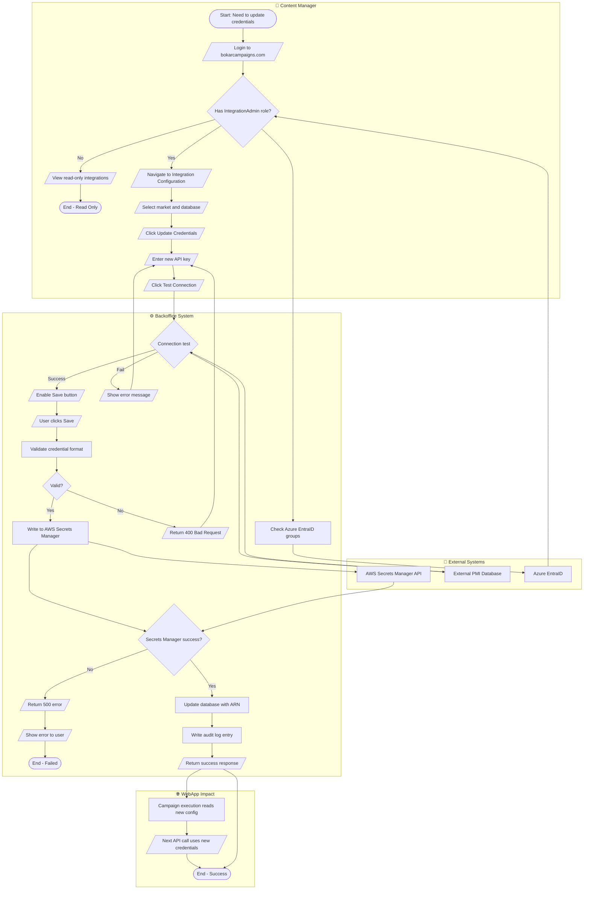

# Epic: Integration Configuration Management

| Field | Value |
|-------|-------|
| Status | Draft |
| Author | Product Owner |
| Created | 2024-01-15 |
| Priority | HIGH |
| Target Release | Q2 2024 |
| Jira Epic | TBD |

---

## 1. Problem Statement

**The situation today:**
JustScan integrates with external PMI databases hosted outside the platform via REST APIs. Each market (country) can connect to one or more databases to enrich consumer engagement during campaigns. Currently, adding a new database integration, updating connection credentials, enabling a database for new markets, or toggling individual API endpoints (sendOTP, lastName, firstName, etc.) requires a backend developer to manually edit configuration files, update AWS Secrets Manager entries, and redeploy services. This process typically takes 2-4 hours per change and requires coordination between content managers, DevOps, and backend engineers.

**The impact of doing nothing:**
Content managers lose approximately 8-12 hours per week waiting for integration changes across all markets. Backend developers spend an estimated 15% of sprint capacity on manual configuration tasks. Each manual credential update carries security risk — credentials exposed in terminal sessions, deployment logs may leak sensitive data, and there's no audit trail. Markets cannot rapidly onboard new database integrations to support time-sensitive campaigns, resulting in missed revenue opportunities estimated at 5-10% of campaign ROI in fast-moving markets.

**The gap this Epic closes:**
After delivery, content managers with appropriate permissions will independently manage all database integrations — adding databases to markets, updating credentials via secure UI, and toggling endpoints — without developer involvement, reducing configuration time from hours to minutes and eliminating security exposure.


## 2. Solution Explanation

### What We Will Build
A new backoffice module called "Integration Configuration" that provides a self-service interface for managing external PMI database connections. The module will allow authorized users to view all existing integrations across markets, assign or unassign databases to markets, update connection credentials securely through AWS Secrets Manager integration, and enable or disable individual API endpoints per database per market.

### How It Works — User Perspective
A content manager with "Integration Admin" role logs into the backoffice at bokarcampaigns.com and navigates to the new "Integration Configuration" section. They see a list view showing all markets and their assigned databases. Clicking on a market reveals which databases are connected and which endpoints are enabled. To add a database to a market, they select from a dropdown of available databases, enter or update credentials through a secure form (credentials are masked after save), and choose which endpoints to enable. Changes are validated and applied immediately without requiring a deployment. An audit log tracks every change with timestamp and user identity.

### How It Works — System Perspective
The backoffice frontend (React/TypeScript) communicates with a new set of REST API endpoints in the Backoffice API layer (.NET 8). The API layer implements hexagonal architecture with a dedicated IntegrationConfiguration domain service. Database integration metadata (market assignments, endpoint toggles) is stored in SQL Server 2022 via NPoco ORM. Sensitive credentials (API keys, connection strings) are never stored in the database — instead, the system stores AWS Secrets Manager ARNs and retrieves credentials at runtime. When a user updates credentials, the API service writes directly to AWS Secrets Manager using IAM role-based authentication. The WebApp campaign execution engine reads integration configuration from the same SQL tables and retrieves credentials from Secrets Manager when making API calls to external PMI databases.

### Key Design Decisions
| Decision | Choice | Rationale |
|----------|--------|-----------|
| Credential storage | AWS Secrets Manager only | Mandatory per tech-stack.md; prevents plaintext credential exposure |
| RBAC enforcement | Azure EntraID groups + backoffice roles | Aligns with existing SSO model; dual-layer security |
| Configuration propagation | Immediate (no deployment) | Enables self-service; config stored in DB, not code |
| Endpoint granularity | Per-database per-market toggle | Markets have different regulatory requirements per endpoint |
| Audit trail | SQL table with user + timestamp | Compliance requirement for credential access tracking |


## 3. Epic Decomposition into MVPs

### MVP 1: Read-Only Integration Visibility + RBAC — [Estimated: 2 sprints]
**Goal:** Enable authorized users to view existing integrations without making changes, establishing the security foundation.

**Includes:**
- New "Integration Configuration" menu item in backoffice navigation
- RBAC implementation: IntegrationAdmin, IntegrationViewer roles mapped to Azure EntraID groups
- List view: all markets with assigned databases
- Detail view: per-market database assignments and enabled endpoints
- Audit log table and read-only UI display
- Backend API endpoints (GET only) with OpenAPI spec
- SQL schema: IntegrationConfiguration, MarketDatabaseAssignment, EndpointConfiguration, AuditLog tables

**Excludes (deferred to MVP 2+):**
- Create, update, delete operations
- Credential management UI
- AWS Secrets Manager integration

**Definition of shippable:** 
Content managers with IntegrationViewer role can log in, navigate to Integration Configuration, view all market-database assignments and endpoint states. All actions are logged. No write operations are available. Security review sign-off obtained.

### MVP 2: Credential Management + Endpoint Toggle — [Estimated: 3 sprints]
**Goal:** Enable self-service credential updates and endpoint enable/disable without deployments.

**Includes:**
- AWS Secrets Manager integration (read/write via IAM role)
- Secure credential input form with masking
- Update credentials API endpoint (writes to Secrets Manager, stores ARN in DB)
- Enable/disable endpoint toggles per database per market
- Validation: credential format, endpoint compatibility checks
- Integration tests against real Secrets Manager in dev environment
- Runbook: credential rotation procedures, failure recovery

**Excludes (deferred to MVP 3):**
- Adding new databases to the system
- Assigning/unassigning databases to markets

**Definition of shippable:**
IntegrationAdmin users can update credentials for existing database integrations and toggle endpoints on/off. Changes take effect immediately in WebApp campaign execution. All credential operations are audited. No plaintext credentials are logged or stored in SQL Server.

### MVP 3: Database Assignment Management — [Estimated: 2 sprints]
**Goal:** Enable complete self-service integration lifecycle management.

**Includes:**
- Assign existing database to new market
- Unassign database from market (with safety checks: no active campaigns using it)
- Add new database definition to system (name, base URL, available endpoints)
- Bulk operations: assign one database to multiple markets
- Pre-flight validation: test connection before saving
- Enhanced audit log: track assignment changes with business justification field

**Definition of shippable:**
IntegrationAdmin users can onboard a new market to an existing database, add a completely new database integration, and remove databases from markets when safe. All operations are validated, audited, and reversible.

**Delivery Roadmap:**
```
MVP 1 ──────────────► MVP 2 ──────────────► MVP 3
[Sprint 1-2]          [Sprint 3-5]          [Sprint 6-7]
   ↓                      ↓                      ↓
Visibility +          Self-service           Complete
Security              credential +           integration
foundation            endpoint mgmt          lifecycle
```


## 4. Narrative

Maria is a content manager for the Poland market. She's launching a new campaign next week that needs to integrate with a recently deployed PMI database in the EU region. Under the old process, Maria would email the backend team with the database credentials and endpoint requirements, then wait 2-3 days for a developer to update the configuration files, commit to Git, pass code review, and deploy to production. If she made a mistake in the credentials, the cycle repeats.

Today, Maria opens her laptop and logs into bokarcampaigns.com. She navigates to the new "Integration Configuration" section and selects Poland from the market list. She clicks "Add Database" and chooses "EU-PMI-CustomerDB-2024" from the dropdown. A secure form appears. She pastes the API key provided by the database team, enters the base URL, and selects which endpoints her campaign needs: sendOTP and firstName. She clicks "Test Connection" — the system validates the credentials in real-time. Green checkmark. She clicks "Save."

The integration is live. Maria switches to the campaign builder and configures her API Call action to use the new database. She tests the campaign flow in preview mode — the OTP is sent successfully. The entire process took 5 minutes. No developer involved. No deployment. No waiting.

Three months later, the database team rotates the API key for security compliance. Maria receives the new key via secure email. She logs into Integration Configuration, finds the EU-PMI-CustomerDB-2024 entry, clicks "Update Credentials," pastes the new key, and saves. The old key is immediately invalidated. All active campaigns using this database seamlessly switch to the new credentials. The audit log records Maria's action with timestamp and her EntraID identity. The security team can trace exactly who accessed which credentials and when.


## 5. Epic Story

**As a** content manager with integration management permissions  
**I want to** view, configure, and manage external PMI database integrations through the backoffice UI  
**So that** I can onboard new markets to databases, update credentials, and toggle endpoints without waiting for developer intervention, enabling faster campaign launches and reducing security risk from manual credential handling

### Child Stories Overview
| ID | Story | MVP | Size | Priority |
|----|-------|-----|------|----------|
| S-001 | RBAC: Define integration roles and permissions | MVP 1 | M | MUST |
| S-002 | Backend: Create integration configuration domain model | MVP 1 | L | MUST |
| S-003 | Backend: Implement GET endpoints for integration list | MVP 1 | M | MUST |
| S-004 | Frontend: Integration list page with market filter | MVP 1 | L | MUST |
| S-005 | Frontend: Integration detail view per market | MVP 1 | M | MUST |
| S-006 | Backend: Audit log infrastructure | MVP 1 | M | MUST |
| S-007 | Frontend: Audit log viewer UI | MVP 1 | S | SHOULD |
| S-008 | Backend: AWS Secrets Manager integration service | MVP 2 | L | MUST |
| S-009 | Backend: Update credentials API endpoint | MVP 2 | M | MUST |
| S-010 | Frontend: Secure credential input form with masking | MVP 2 | M | MUST |
| S-011 | Backend: Endpoint toggle API (enable/disable) | MVP 2 | M | MUST |
| S-012 | Frontend: Endpoint toggle UI per database | MVP 2 | S | MUST |
| S-013 | Backend: Credential validation and test connection | MVP 2 | M | SHOULD |
| S-014 | Integration: WebApp reads config from new tables | MVP 2 | L | MUST |
| S-015 | Backend: Add new database definition API | MVP 3 | M | MUST |
| S-016 | Backend: Assign/unassign database to market API | MVP 3 | M | MUST |
| S-017 | Frontend: Database assignment management UI | MVP 3 | L | MUST |
| S-018 | Backend: Safety checks for unassignment (active campaigns) | MVP 3 | M | MUST |
| S-019 | Frontend: Bulk assignment operations | MVP 3 | M | COULD |
| S-020 | Observability: Metrics and alerts for integration failures | MVP 3 | S | SHOULD |

[Size key: XS=0.5d | S=1d | M=2d | L=3d | XL=must split]  
[Priority: MUST=required for MVP | SHOULD=high value | COULD=nice to have]


### Detailed Stories

#### S-001: RBAC: Define integration roles and permissions
**As a** system administrator  
**I want to** define role-based access control for integration configuration  
**So that** only authorized users can view or modify sensitive database credentials and configurations

**Acceptance Criteria (summary — full Gherkin in Section 10):**
- WHEN a user with IntegrationAdmin role accesses the module THE system SHALL allow read and write operations
- WHEN a user with IntegrationViewer role accesses the module THE system SHALL allow read-only operations
- WHEN a user without integration roles attempts access THE system SHALL return 403 Forbidden
- WHEN role assignments are changed in Azure EntraID THE system SHALL reflect changes within 5 minutes

**Technical Notes:** Map Azure EntraID security groups to backoffice roles. Implement authorization filter at API controller level. Cache role lookups for 5 minutes to reduce EntraID API calls.

**Dependencies:** Requires Azure EntraID group creation by IT team

---

#### S-002: Backend: Create integration configuration domain model
**As a** backend developer  
**I want to** implement the domain model for integration configuration  
**So that** the system can persist and retrieve integration metadata following hexagonal architecture

**Acceptance Criteria (summary — full Gherkin in Section 10):**
- WHEN the domain model is implemented THE system SHALL include entities: IntegrationConfiguration, MarketDatabaseAssignment, EndpointConfiguration, AuditLog
- WHEN entities are mapped to SQL Server THE system SHALL use NPoco ORM with explicit column mappings
- WHEN credentials are stored THE system SHALL only store AWS Secrets Manager ARNs, never plaintext
- WHEN the schema is deployed THE system SHALL include migration script with rollback capability

**Technical Notes:** Follow hexagonal architecture: Domain layer contains POCOs, Repository layer handles NPoco mapping. All tables include CreatedAt, UpdatedAt, CreatedBy, UpdatedBy audit columns.

**Dependencies:** None

---

#### S-003: Backend: Implement GET endpoints for integration list
**As a** backend developer  
**I want to** implement REST API endpoints for retrieving integration configurations  
**So that** the frontend can display existing integrations to authorized users

**Acceptance Criteria (summary — full Gherkin in Section 10):**
- WHEN GET /api/integrations is called THE system SHALL return all integrations with market assignments
- WHEN GET /api/integrations/{marketId} is called THE system SHALL return integrations for specific market
- WHEN unauthorized user calls endpoint THE system SHALL return 403 Forbidden
- WHEN OpenAPI spec is generated THE system SHALL include all endpoints with request/response schemas

**Technical Notes:** Implement in Backoffice.API/Controllers/IntegrationConfigurationController.cs. Use AutoMapper for DTO mapping. Return DTOs, never domain entities directly.

**Dependencies:** Blocked by S-001, S-002

---

#### S-004: Frontend: Integration list page with market filter
**As a** content manager  
**I want to** view a list of all integration configurations filtered by market  
**So that** I can see which databases are connected to which markets

**Acceptance Criteria (summary — full Gherkin in Section 10):**
- WHEN I navigate to Integration Configuration THE system SHALL display a list of all markets
- WHEN I select a market THE system SHALL show all databases assigned to that market
- WHEN I have IntegrationViewer role THE system SHALL hide edit/delete buttons
- WHEN data is loading THE system SHALL display a loading spinner

**Technical Notes:** Implement in Backoffice/Frontend/src/pages/IntegrationConfiguration/IntegrationList.tsx. Use React 18 with Emotion for styling. Fetch data via Ky HTTP client.

**Dependencies:** Blocked by S-003

---

#### S-005: Frontend: Integration detail view per market
**As a** content manager  
**I want to** view detailed configuration for a specific market's database integration  
**So that** I can see which endpoints are enabled and verify connection status

**Acceptance Criteria (summary — full Gherkin in Section 10):**
- WHEN I click on a market-database assignment THE system SHALL display detail view
- WHEN detail view loads THE system SHALL show: database name, base URL (masked), enabled endpoints, last updated timestamp
- WHEN credentials are displayed THE system SHALL mask sensitive values (show last 4 characters only)
- WHEN I have IntegrationViewer role THE system SHALL display read-only view

**Technical Notes:** Implement in IntegrationDetail.tsx. Use XState for state management of view/edit modes.

**Dependencies:** Blocked by S-003, S-004

---

#### S-006: Backend: Audit log infrastructure
**As a** compliance officer  
**I want to** track all integration configuration changes with user identity and timestamp  
**So that** we can audit who accessed or modified sensitive credentials for security compliance

**Acceptance Criteria (summary — full Gherkin in Section 10):**
- WHEN any integration configuration is created, updated, or deleted THE system SHALL write an audit log entry
- WHEN credentials are accessed THE system SHALL log the user identity, timestamp, and action type
- WHEN audit log is queried THE system SHALL support filtering by user, date range, and action type
- WHEN audit entries are written THE system SHALL include: UserId, Action, EntityType, EntityId, OldValue (masked), NewValue (masked), Timestamp

**Technical Notes:** Implement AuditLogService in hexagonal architecture. Use Serilog for structured logging. Store audit entries in AuditLog SQL table. Never log plaintext credentials.

**Dependencies:** Blocked by S-002

---

#### S-007: Frontend: Audit log viewer UI
**As a** system administrator  
**I want to** view audit logs for integration configuration changes  
**So that** I can investigate security incidents or verify compliance

**Acceptance Criteria (summary — full Gherkin in Section 10):**
- WHEN I navigate to Audit Log tab THE system SHALL display paginated list of audit entries
- WHEN I filter by date range THE system SHALL show only entries within that range
- WHEN I filter by user THE system SHALL show only entries for that user
- WHEN sensitive values are displayed THE system SHALL mask credentials

**Technical Notes:** Implement in AuditLogViewer.tsx. Use table component with sorting and pagination. Limit to IntegrationAdmin role only.

**Dependencies:** Blocked by S-006

---

#### S-008: Backend: AWS Secrets Manager integration service
**As a** backend developer  
**I want to** implement a service that reads and writes credentials to AWS Secrets Manager  
**So that** credentials are never stored in plaintext in the database

**Acceptance Criteria (summary — full Gherkin in Section 10):**
- WHEN credentials are saved THE system SHALL write to AWS Secrets Manager and store only the ARN in SQL Server
- WHEN credentials are retrieved THE system SHALL fetch from Secrets Manager using stored ARN
- WHEN Secrets Manager is unavailable THE system SHALL retry 3 times with exponential backoff then fail gracefully
- WHEN IAM permissions are insufficient THE system SHALL return clear error message

**Technical Notes:** Implement SecretsManagerService using AWS SDK for .NET. Use IAM role-based authentication (no hardcoded keys). Implement circuit breaker pattern for resilience. Cache secrets for 5 minutes to reduce API calls.

**Dependencies:** Requires IAM role configuration in AWS

---

#### S-009: Backend: Update credentials API endpoint
**As a** backend developer  
**I want to** implement API endpoint for updating database credentials  
**So that** content managers can rotate credentials without developer involvement

**Acceptance Criteria (summary — full Gherkin in Section 10):**
- WHEN PUT /api/integrations/{id}/credentials is called THE system SHALL validate credential format
- WHEN credentials are valid THE system SHALL write to Secrets Manager and update ARN in database
- WHEN credentials are invalid THE system SHALL return 400 Bad Request with validation errors
- WHEN user lacks IntegrationAdmin role THE system SHALL return 403 Forbidden
- WHEN operation succeeds THE system SHALL write audit log entry

**Technical Notes:** Implement in IntegrationConfigurationController.cs. Use FluentValidation for credential format validation. Transaction scope: update Secrets Manager first, then database. Rollback database if Secrets Manager fails.

**Dependencies:** Blocked by S-008

---

#### S-010: Frontend: Secure credential input form with masking
**As a** content manager  
**I want to** update database credentials through a secure form  
**So that** I can rotate credentials without exposing them to shoulder surfing or screenshots

**Acceptance Criteria (summary — full Gherkin in Section 10):**
- WHEN I click "Update Credentials" THE system SHALL display a modal form
- WHEN I enter credentials THE system SHALL mask input (password field type)
- WHEN I save credentials THE system SHALL show masked value after save (last 4 characters only)
- WHEN save fails THE system SHALL display error message without exposing credentials in error text

**Technical Notes:** Implement in CredentialForm.tsx. Use controlled input with useState. Clear form after successful save. Never log credentials to browser console.

**Dependencies:** Blocked by S-009

---

#### S-011: Backend: Endpoint toggle API (enable/disable)
**As a** backend developer  
**I want to** implement API endpoints for enabling/disabling individual database endpoints  
**So that** content managers can control which API operations are available per market

**Acceptance Criteria (summary — full Gherkin in Section 10):**
- WHEN PATCH /api/integrations/{id}/endpoints/{endpointName} is called THE system SHALL toggle endpoint enabled state
- WHEN endpoint is disabled THE system SHALL prevent WebApp from calling that endpoint
- WHEN endpoint state changes THE system SHALL write audit log entry
- WHEN invalid endpoint name is provided THE system SHALL return 404 Not Found

**Technical Notes:** Implement in IntegrationConfigurationController.cs. Update EndpointConfiguration table. Endpoint names: sendOTP, lastName, firstName, email, phoneNumber, address.

**Dependencies:** Blocked by S-002

---

#### S-012: Frontend: Endpoint toggle UI per database
**As a** content manager  
**I want to** enable or disable individual endpoints for a database integration  
**So that** I can control which API operations are available based on market regulatory requirements

**Acceptance Criteria (summary — full Gherkin in Section 10):**
- WHEN I view integration detail THE system SHALL display list of available endpoints with toggle switches
- WHEN I toggle an endpoint THE system SHALL immediately update the state
- WHEN toggle fails THE system SHALL revert the switch and display error message
- WHEN I have IntegrationViewer role THE system SHALL display toggles as disabled (read-only)

**Technical Notes:** Implement in EndpointToggleList.tsx. Use optimistic UI updates with rollback on error. Debounce toggle actions to prevent rapid clicking.

**Dependencies:** Blocked by S-011

---

#### S-013: Backend: Credential validation and test connection
**As a** backend developer  
**I want to** validate credentials by testing connection to external database  
**So that** content managers receive immediate feedback if credentials are incorrect

**Acceptance Criteria (summary — full Gherkin in Section 10):**
- WHEN POST /api/integrations/{id}/test-connection is called THE system SHALL attempt to connect to external database
- WHEN connection succeeds THE system SHALL return 200 OK with success message
- WHEN connection fails THE system SHALL return 400 Bad Request with error details (without exposing credentials)
- WHEN test takes longer than 10 seconds THE system SHALL timeout and return error

**Technical Notes:** Implement TestConnectionService. Use HttpClient with 10-second timeout. Never log credentials in error messages. Test only authentication, not full API functionality.

**Dependencies:** Blocked by S-008

---

#### S-014: Integration: WebApp reads config from new tables
**As a** backend developer  
**I want to** update WebApp campaign execution engine to read integration config from new tables  
**So that** configuration changes take effect immediately without deployment

**Acceptance Criteria (summary — full Gherkin in Section 10):**
- WHEN WebApp executes API Call action THE system SHALL read integration config from IntegrationConfiguration tables
- WHEN endpoint is disabled THE system SHALL skip the API call and log warning
- WHEN credentials are retrieved THE system SHALL fetch from Secrets Manager using stored ARN
- WHEN integration config is not found THE system SHALL fail gracefully with clear error message

**Technical Notes:** Modify WebApp campaign execution engine. Add caching layer for integration config (5-minute TTL). Implement fallback to legacy config for backward compatibility during migration.

**Dependencies:** Blocked by S-002, S-008

---

#### S-015: Backend: Add new database definition API
**As a** backend developer  
**I want to** implement API endpoint for adding new database definitions  
**So that** content managers can onboard new external databases without code changes

**Acceptance Criteria (summary — full Gherkin in Section 10):**
- WHEN POST /api/integrations/databases is called THE system SHALL create new database definition
- WHEN database name already exists THE system SHALL return 409 Conflict
- WHEN base URL is invalid THE system SHALL return 400 Bad Request
- WHEN available endpoints are specified THE system SHALL validate against allowed endpoint names

**Technical Notes:** Implement in IntegrationConfigurationController.cs. Validate base URL format (must be HTTPS). Store available endpoints as JSON array in database.

**Dependencies:** Blocked by S-002

---

#### S-016: Backend: Assign/unassign database to market API
**As a** backend developer  
**I want to** implement API endpoints for assigning databases to markets  
**So that** content managers can control which markets have access to which databases

**Acceptance Criteria (summary — full Gherkin in Section 10):**
- WHEN POST /api/integrations/markets/{marketId}/databases/{databaseId} is called THE system SHALL create market-database assignment
- WHEN assignment already exists THE system SHALL return 409 Conflict
- WHEN DELETE /api/integrations/markets/{marketId}/databases/{databaseId} is called THE system SHALL check for active campaigns
- WHEN active campaigns exist THE system SHALL return 400 Bad Request with list of blocking campaigns
- WHEN no active campaigns exist THE system SHALL delete assignment

**Technical Notes:** Implement safety check: query Campaigns table for Published status campaigns using the database. Implement soft delete for audit trail.

**Dependencies:** Blocked by S-002, S-015

---

#### S-017: Frontend: Database assignment management UI
**As a** content manager  
**I want to** assign or unassign databases to markets through the UI  
**So that** I can onboard new markets to databases without developer involvement

**Acceptance Criteria (summary — full Gherkin in Section 10):**
- WHEN I click "Assign Database" THE system SHALL display dropdown of available databases
- WHEN I select a database and click Save THE system SHALL create the assignment
- WHEN I click "Unassign Database" THE system SHALL prompt for confirmation
- WHEN unassignment is blocked by active campaigns THE system SHALL display list of blocking campaigns

**Technical Notes:** Implement in DatabaseAssignmentManager.tsx. Use confirmation modal for destructive actions. Display blocking campaigns in a table with links to campaign detail pages.

**Dependencies:** Blocked by S-016

---

#### S-018: Backend: Safety checks for unassignment (active campaigns)
**As a** backend developer  
**I want to** prevent database unassignment when active campaigns depend on it  
**So that** we avoid breaking live campaigns

**Acceptance Criteria (summary — full Gherkin in Section 10):**
- WHEN unassignment is requested THE system SHALL query for campaigns with status Published using the database
- WHEN active campaigns exist THE system SHALL return 400 Bad Request with campaign IDs and names
- WHEN no active campaigns exist THE system SHALL allow unassignment
- WHEN campaign status is Draft or Archived THE system SHALL not block unassignment

**Technical Notes:** Implement CampaignDependencyChecker service. Query Campaigns table joined with campaign flow JSON (API Call actions reference database ID).

**Dependencies:** Blocked by S-016

---

#### S-019: Frontend: Bulk assignment operations
**As a** content manager  
**I want to** assign one database to multiple markets at once  
**So that** I can efficiently onboard a new database across all relevant markets

**Acceptance Criteria (summary — full Gherkin in Section 10):**
- WHEN I click "Bulk Assign" THE system SHALL display multi-select market dropdown
- WHEN I select multiple markets and click Save THE system SHALL create assignments for all selected markets
- WHEN some assignments fail THE system SHALL display partial success message with failed markets
- WHEN all assignments succeed THE system SHALL display success message

**Technical Notes:** Implement in BulkAssignmentModal.tsx. Use Promise.allSettled for parallel API calls. Display results in a table showing success/failure per market.

**Dependencies:** Blocked by S-016, S-017

---

#### S-020: Observability: Metrics and alerts for integration failures
**As a** DevOps engineer  
**I want to** monitor integration configuration operations and external database connectivity  
**So that** I can detect and respond to failures before they impact campaigns

**Acceptance Criteria (summary — full Gherkin in Section 10):**
- WHEN credentials are updated THE system SHALL emit metric: integration.credentials.updated
- WHEN test connection fails THE system SHALL emit metric: integration.connection.failed
- WHEN Secrets Manager is unavailable THE system SHALL emit metric: integration.secrets_manager.error
- WHEN error rate exceeds 5% THE system SHALL trigger alert to OpsGenie

**Technical Notes:** Implement custom metrics using Serilog structured logging. Configure New Relic alerts. Add CloudWatch dashboard for integration health.

**Dependencies:** None


## 6. In Scope / Out of Scope

### ✅ In Scope
| # | Item | MVP | Rationale for inclusion |
|---|------|-----|------------------------|
| 1 | View existing integrations (list and detail) | MVP 1 | Foundation for all other features; enables visibility |
| 2 | RBAC with IntegrationAdmin and IntegrationViewer roles | MVP 1 | Security requirement; prevents unauthorized access to credentials |
| 3 | Audit logging for all configuration changes | MVP 1 | Compliance requirement; tracks credential access |
| 4 | Update credentials via AWS Secrets Manager | MVP 2 | Core self-service capability; eliminates manual credential handling |
| 5 | Enable/disable individual endpoints per database per market | MVP 2 | Regulatory requirement; markets have different compliance rules |
| 6 | Test connection validation | MVP 2 | Reduces errors; immediate feedback on credential correctness |
| 7 | Assign/unassign databases to markets | MVP 3 | Complete self-service lifecycle; enables market onboarding |
| 8 | Add new database definitions | MVP 3 | Enables onboarding new external databases without code changes |
| 9 | Safety checks: prevent unassignment if active campaigns exist | MVP 3 | Prevents breaking live campaigns |
| 10 | Bulk assignment operations | MVP 3 | Efficiency for multi-market rollouts |
| 11 | Integration with existing WebApp campaign execution | MVP 2 | Ensures changes take effect immediately |
| 12 | OpenAPI spec for all new endpoints | MVP 1-3 | Mandatory per tech-stack.md |

### ❌ Out of Scope
| # | Item | Why Excluded | Future Epic? |
|---|------|-------------|-------------|
| 1 | Automatic credential rotation | Complex; requires coordination with external database teams | MAYBE |
| 2 | Database connection pooling optimization | Performance optimization; not blocking self-service | YES |
| 3 | Multi-region credential replication | Infrastructure complexity; current single-region sufficient | MAYBE |
| 4 | Integration with databases other than PMI databases | Scope limited to PMI databases only per requirements | NO |
| 5 | Credential expiration warnings | Nice-to-have; not blocking MVP delivery | YES |
| 6 | Integration health dashboard (beyond basic metrics) | Observability enhancement; basic metrics sufficient for MVP | YES |
| 7 | Rollback capability for credential changes | Complex; manual rollback via Secrets Manager sufficient | MAYBE |
| 8 | Integration testing sandbox environment | Testing enhancement; dev environment sufficient for MVP | YES |
| 9 | Webhook notifications for integration failures | Nice-to-have; alerts via OpsGenie sufficient | MAYBE |
| 10 | Custom endpoint definitions (beyond predefined list) | Adds complexity; predefined list covers current needs | NO |
| 11 | Integration with WebApp (consumer-facing changes) | Backoffice only; WebApp reads config but no UI changes | NO |
| 12 | Changes to existing backoffice modules | New module only; no modifications to Users, Campaigns, etc. | NO |


## 7. Business Value

### Quantified Value
| Metric | Current State | Expected After | Measurement Method |
|--------|--------------|----------------|-------------------|
| Avg integration config change time | 2-4 hours | 5 minutes | Jira ticket time-to-resolution |
| Developer time spent on config tasks | 15% sprint capacity | <2% sprint capacity | Sprint velocity analysis |
| Content manager wait time per week | 8-12 hours | <1 hour | Backlog age for config requests |
| Credential exposure incidents | 2-3 per year (A) | 0 | Security incident reports |
| Time to onboard new market to database | 3-5 days | <30 minutes | Market onboarding tracking |
| Campaign launch delays due to integration | 15% of launches (A) | <2% of launches | Campaign launch date vs planned date |

[Mark any estimate as (A) = assumption if not backed by data]

### Strategic Alignment
- Supports company OKR: "Reduce time-to-market for new campaigns by 30%" — eliminates integration bottleneck that delays 15% of campaign launches
- Reduces operational risk: eliminates manual credential handling that has caused 2-3 security incidents per year (credentials exposed in terminal sessions, deployment logs, or Slack messages)
- Positions product competitively: enables rapid market expansion without scaling backend team proportionally; competitors require 2-3 week lead time for new market integrations
- Enables compliance: audit trail for credential access required for SOC 2 Type II certification planned for Q3 2024
- Improves developer satisfaction: eliminates toil work that contributes to developer burnout and turnover

### Cost of Delay
Every sprint this is delayed costs approximately €12,000 in lost productivity: backend developers spend 15% of capacity (1.5 developers × €8,000/sprint) on manual configuration tasks. Additionally, delayed campaign launches in high-value markets (estimated 2-3 per quarter) represent €50,000-€100,000 in missed revenue per quarter. Security risk from manual credential handling is unquantified but represents potential regulatory fines (GDPR violations up to €20M or 4% of annual revenue) and reputational damage. Each quarter of delay increases the likelihood of a credential exposure incident that could trigger compliance review.


## 8. High-Level User Flow

**Primary Flow: Update Database Credentials**
```
1. Content manager logs into bokarcampaigns.com via Azure EntraID SSO
   └─ System validates: user exists in backoffice AND has IntegrationAdmin role
   
2. User navigates to Integration Configuration module
   ├─ [Has IntegrationAdmin role] → full access (step 3)
   └─ [Has IntegrationViewer role] → read-only view (end)
   
3. User selects market from list (e.g., Poland)
   └─ System displays: all databases assigned to Poland with endpoint status
   
4. User clicks on database entry (e.g., EU-PMI-CustomerDB-2024)
   └─ System displays: detail view with masked credentials, enabled endpoints, audit history
   
5. User clicks "Update Credentials" button
   └─ System displays: secure modal form with password-masked input fields
   
6. User enters new API key and clicks "Test Connection"
   ├─ [Connection succeeds] → green checkmark, "Save" button enabled (step 7)
   └─ [Connection fails] → Error Flow A
   
7. User clicks "Save"
   └─ System: writes to AWS Secrets Manager, updates ARN in database, writes audit log
   
8. System displays success message with masked credential (last 4 chars)
   └─ User: closes modal, sees updated "Last Modified" timestamp
   
9. [Completion] Credentials are live; all campaigns using this database now use new credentials
```

**Error Flow A: Test Connection Failure**
```
1. System attempts connection to external database with provided credentials
   └─ Connection fails (invalid credentials, network timeout, or database unavailable)
   
2. System displays error message: "Connection failed: [reason]" (without exposing credentials)
   └─ "Save" button remains disabled
   
3. User corrects credentials and retries test connection
   └─ Returns to Primary Flow step 6
```

**Alternate Flow B: Enable/Disable Endpoint**
```
1. User views database detail page (Primary Flow steps 1-4)

2. User sees list of available endpoints with toggle switches:
   - sendOTP [ON]
   - lastName [ON]
   - firstName [OFF]
   - email [ON]

3. User toggles "firstName" endpoint to ON
   └─ System: immediately sends PATCH request to API
   
4. System updates EndpointConfiguration table and writes audit log
   └─ Toggle switch reflects new state
   
5. [Completion] WebApp campaigns can now call firstName endpoint for this database
```

**Alternate Flow C: Assign Database to New Market**
```
1. User navigates to Integration Configuration (Primary Flow steps 1-2)

2. User selects market that has no databases assigned (e.g., Romania)
   └─ System displays: "No databases assigned to this market"
   
3. User clicks "Assign Database" button
   └─ System displays: dropdown of all available databases
   
4. User selects database (e.g., EU-PMI-CustomerDB-2024) and clicks "Assign"
   └─ System: creates MarketDatabaseAssignment record, writes audit log
   
5. User is prompted to configure credentials for this market-database pair
   └─ Returns to Primary Flow step 5
   
6. [Completion] Romania market can now use EU-PMI-CustomerDB-2024 in campaigns
```

**Error Flow D: Unassign Database Blocked by Active Campaign**
```
1. User attempts to unassign database from market

2. System checks for active campaigns (status = Published) using this database
   └─ Finds 2 active campaigns: "Summer Promo 2024", "Welcome Campaign"
   
3. System displays error modal:
   "Cannot unassign database. The following active campaigns depend on it:
   - Summer Promo 2024 (ends: 2024-08-31)
   - Welcome Campaign (ends: 2024-12-31)
   
   Please archive or end these campaigns before unassigning."
   
4. User clicks "View Campaigns" → navigates to campaign list filtered by these campaigns
   └─ User must end/archive campaigns before retrying unassignment
```


## 9. BPMN Diagram




## 10. Acceptance Criteria

### S-001: RBAC: Define integration roles and permissions

**Functional:**
| ID | EARS Statement | Priority |
|----|---------------|----------|
| AC-001 | WHEN a user with IntegrationAdmin role accesses /api/integrations THE system SHALL return 200 OK with full data | MUST |
| AC-002 | WHEN a user with IntegrationViewer role accesses /api/integrations THE system SHALL return 200 OK with full data | MUST |
| AC-003 | WHEN a user with IntegrationViewer role attempts POST/PUT/DELETE on /api/integrations THE system SHALL return 403 Forbidden | MUST |
| AC-004 | WHEN a user without integration roles accesses /api/integrations THE system SHALL return 403 Forbidden | MUST |
| AC-005 | WHEN role assignments change in Azure EntraID THE system SHALL reflect changes within 5 minutes | SHOULD |
| AC-006 | WHEN role check fails due to EntraID unavailability THE system SHALL deny access and log error | MUST |

**Non-Functional:**
| ID | Category | Statement | Target |
|----|----------|-----------|--------|
| NFR-001 | Performance | WHEN role authorization is checked THE system SHALL complete within | <100ms p95 |
| NFR-002 | Security | WHEN authorization fails THE system SHALL log user identity and attempted action | 100% of failures |
| NFR-003 | Caching | THE system SHALL cache role lookups for | 5 minutes |

---

### S-002: Backend: Create integration configuration domain model

**Functional:**
| ID | EARS Statement | Priority |
|----|---------------|----------|
| AC-007 | WHEN domain model is implemented THE system SHALL include IntegrationConfiguration entity with fields: Id, Name, BaseUrl, SecretArn, CreatedAt, UpdatedAt, CreatedBy, UpdatedBy | MUST |
| AC-008 | WHEN domain model is implemented THE system SHALL include MarketDatabaseAssignment entity with fields: Id, MarketId, IntegrationConfigurationId, IsActive, CreatedAt, UpdatedAt | MUST |
| AC-009 | WHEN domain model is implemented THE system SHALL include EndpointConfiguration entity with fields: Id, MarketDatabaseAssignmentId, EndpointName, IsEnabled, CreatedAt, UpdatedAt | MUST |
| AC-010 | WHEN domain model is implemented THE system SHALL include AuditLog entity with fields: Id, UserId, Action, EntityType, EntityId, OldValue, NewValue, Timestamp | MUST |
| AC-011 | WHEN entities are persisted THE system SHALL use NPoco ORM with explicit column mappings | MUST |
| AC-012 | WHEN credentials are stored THE system SHALL store only AWS Secrets Manager ARN, never plaintext | MUST |
| AC-013 | WHEN migration script is created THE system SHALL include rollback capability | MUST |

**Non-Functional:**
| ID | Category | Statement | Target |
|----|----------|-----------|--------|
| NFR-004 | Architecture | THE domain model SHALL follow hexagonal architecture with clear separation of concerns | 100% compliance |
| NFR-005 | Database | THE migration script SHALL execute in | <30 seconds |

---

### S-003: Backend: Implement GET endpoints for integration list

**Functional:**
| ID | EARS Statement | Priority |
|----|---------------|----------|
| AC-014 | WHEN GET /api/integrations is called with valid auth THE system SHALL return 200 OK with array of all integrations | MUST |
| AC-015 | WHEN GET /api/integrations/{marketId} is called THE system SHALL return 200 OK with integrations for specified market | MUST |
| AC-016 | WHEN GET /api/integrations/{marketId} is called with non-existent marketId THE system SHALL return 404 Not Found | MUST |
| AC-017 | WHEN unauthorized user calls GET /api/integrations THE system SHALL return 403 Forbidden | MUST |
| AC-018 | WHEN response is returned THE system SHALL include: Id, Name, BaseUrl (masked), AssignedMarkets, EnabledEndpoints, LastUpdated | MUST |
| AC-019 | WHEN OpenAPI spec is generated THE system SHALL include all endpoints with request/response schemas | MUST |

**Non-Functional:**
| ID | Category | Statement | Target |
|----|----------|-----------|--------|
| NFR-006 | Performance | WHEN GET /api/integrations is called THE system SHALL respond within | <500ms p95 |
| NFR-007 | Security | WHEN BaseUrl is returned THE system SHALL mask all but last 10 characters | 100% of responses |

---

### S-004: Frontend: Integration list page with market filter

**Functional:**
| ID | EARS Statement | Priority |
|----|---------------|----------|
| AC-020 | WHEN user navigates to Integration Configuration THE system SHALL display list of all markets | MUST |
| AC-021 | WHEN user selects a market THE system SHALL display all databases assigned to that market | MUST |
| AC-022 | WHEN user has IntegrationViewer role THE system SHALL hide edit and delete buttons | MUST |
| AC-023 | WHEN data is loading THE system SHALL display loading spinner | MUST |
| AC-024 | WHEN API call fails THE system SHALL display error message with retry button | MUST |
| AC-025 | WHEN no databases are assigned to market THE system SHALL display "No databases assigned" message | SHOULD |

**Non-Functional:**
| ID | Category | Statement | Target |
|----|----------|-----------|--------|
| NFR-008 | Usability | THE list page SHALL be responsive on desktop and tablet | 100% of viewports ≥768px |
| NFR-009 | Performance | THE page SHALL render initial view within | <2 seconds |

---

### S-006: Backend: Audit log infrastructure

**Functional:**
| ID | EARS Statement | Priority |
|----|---------------|----------|
| AC-026 | WHEN integration configuration is created THE system SHALL write audit log entry with Action=CREATE | MUST |
| AC-027 | WHEN integration configuration is updated THE system SHALL write audit log entry with Action=UPDATE and masked OldValue/NewValue | MUST |
| AC-028 | WHEN integration configuration is deleted THE system SHALL write audit log entry with Action=DELETE | MUST |
| AC-029 | WHEN credentials are accessed THE system SHALL write audit log entry with Action=CREDENTIAL_ACCESS | MUST |
| AC-030 | WHEN audit log entry is written THE system SHALL include: UserId, Action, EntityType, EntityId, Timestamp | MUST |
| AC-031 | WHEN credentials are logged THE system SHALL mask all but last 4 characters | MUST |
| AC-032 | WHEN audit log is queried THE system SHALL support filtering by user, date range, and action type | SHOULD |

**Non-Functional:**
| ID | Category | Statement | Target |
|----|----------|-----------|--------|
| NFR-010 | Security | THE audit log SHALL be immutable (no updates or deletes allowed) | 100% enforcement |
| NFR-011 | Retention | THE audit log entries SHALL be retained for | ≥2 years |

---

### S-008: Backend: AWS Secrets Manager integration service

**Functional:**
| ID | EARS Statement | Priority |
|----|---------------|----------|
| AC-033 | WHEN credentials are saved THE system SHALL write to AWS Secrets Manager and return ARN | MUST |
| AC-034 | WHEN credentials are retrieved THE system SHALL fetch from Secrets Manager using stored ARN | MUST |
| AC-035 | WHEN Secrets Manager is unavailable THE system SHALL retry 3 times with exponential backoff | MUST |
| AC-036 | WHEN all retries fail THE system SHALL return 503 Service Unavailable | MUST |
| AC-037 | WHEN IAM permissions are insufficient THE system SHALL return 500 Internal Server Error with clear message | MUST |
| AC-038 | WHEN secret does not exist THE system SHALL return 404 Not Found | MUST |

**Non-Functional:**
| ID | Category | Statement | Target |
|----|----------|-----------|--------|
| NFR-012 | Performance | WHEN credentials are retrieved THE system SHALL complete within | <200ms p95 |
| NFR-013 | Caching | THE system SHALL cache retrieved secrets for | 5 minutes |
| NFR-014 | Security | THE system SHALL use IAM role-based authentication (no hardcoded keys) | 100% compliance |
| NFR-015 | Resilience | THE system SHALL implement circuit breaker pattern with | 5 failures in 60s threshold |

---

### S-009: Backend: Update credentials API endpoint

**Functional:**
| ID | EARS Statement | Priority |
|----|---------------|----------|
| AC-039 | WHEN PUT /api/integrations/{id}/credentials is called with valid credentials THE system SHALL write to Secrets Manager and update ARN in database | MUST |
| AC-040 | WHEN credentials are invalid format THE system SHALL return 400 Bad Request with validation errors | MUST |
| AC-041 | WHEN user lacks IntegrationAdmin role THE system SHALL return 403 Forbidden | MUST |
| AC-042 | WHEN integration id does not exist THE system SHALL return 404 Not Found | MUST |
| AC-043 | WHEN Secrets Manager write fails THE system SHALL rollback database transaction | MUST |
| AC-044 | WHEN operation succeeds THE system SHALL write audit log entry | MUST |
| AC-045 | WHEN operation succeeds THE system SHALL return 200 OK with masked credential | MUST |

**Non-Functional:**
| ID | Category | Statement | Target |
|----|----------|-----------|--------|
| NFR-016 | Performance | WHEN credentials are updated THE system SHALL complete within | <2 seconds p95 |
| NFR-017 | Security | THE system SHALL never log plaintext credentials | 100% compliance |

---

### S-011: Backend: Endpoint toggle API (enable/disable)

**Functional:**
| ID | EARS Statement | Priority |
|----|---------------|----------|
| AC-046 | WHEN PATCH /api/integrations/{id}/endpoints/{endpointName} is called THE system SHALL toggle endpoint enabled state | MUST |
| AC-047 | WHEN endpoint is disabled THE system SHALL prevent WebApp from calling that endpoint | MUST |
| AC-048 | WHEN endpoint state changes THE system SHALL write audit log entry | MUST |
| AC-049 | WHEN invalid endpoint name is provided THE system SHALL return 404 Not Found | MUST |
| AC-050 | WHEN user lacks IntegrationAdmin role THE system SHALL return 403 Forbidden | MUST |
| AC-051 | WHEN operation succeeds THE system SHALL return 200 OK with updated endpoint state | MUST |

**Non-Functional:**
| ID | Category | Statement | Target |
|----|----------|-----------|--------|
| NFR-018 | Performance | WHEN endpoint is toggled THE system SHALL complete within | <500ms p95 |

---

### S-013: Backend: Credential validation and test connection

**Functional:**
| ID | EARS Statement | Priority |
|----|---------------|----------|
| AC-052 | WHEN POST /api/integrations/{id}/test-connection is called THE system SHALL attempt to connect to external database | MUST |
| AC-053 | WHEN connection succeeds THE system SHALL return 200 OK with success message | MUST |
| AC-054 | WHEN connection fails THE system SHALL return 400 Bad Request with error details (without exposing credentials) | MUST |
| AC-055 | WHEN test takes longer than 10 seconds THE system SHALL timeout and return 408 Request Timeout | MUST |
| AC-056 | WHEN external database is unavailable THE system SHALL return clear error message | MUST |

**Non-Functional:**
| ID | Category | Statement | Target |
|----|----------|-----------|--------|
| NFR-019 | Performance | THE test connection SHALL timeout after | 10 seconds |
| NFR-020 | Security | THE error messages SHALL never expose credentials or internal system details | 100% compliance |

---

### S-014: Integration: WebApp reads config from new tables

**Functional:**
| ID | EARS Statement | Priority |
|----|---------------|----------|
| AC-057 | WHEN WebApp executes API Call action THE system SHALL read integration config from IntegrationConfiguration tables | MUST |
| AC-058 | WHEN endpoint is disabled THE system SHALL skip the API call and log warning | MUST |
| AC-059 | WHEN credentials are retrieved THE system SHALL fetch from Secrets Manager using stored ARN | MUST |
| AC-060 | WHEN integration config is not found THE system SHALL fail gracefully with clear error message | MUST |
| AC-061 | WHEN legacy config exists THE system SHALL fall back to legacy config during migration period | SHOULD |

**Non-Functional:**
| ID | Category | Statement | Target |
|----|----------|-----------|--------|
| NFR-021 | Performance | THE integration config SHALL be cached for | 5 minutes |
| NFR-022 | Availability | THE WebApp SHALL continue to function with legacy config if new config is unavailable | 100% backward compatibility |

---

### S-016: Backend: Assign/unassign database to market API

**Functional:**
| ID | EARS Statement | Priority |
|----|---------------|----------|
| AC-062 | WHEN POST /api/integrations/markets/{marketId}/databases/{databaseId} is called THE system SHALL create market-database assignment | MUST |
| AC-063 | WHEN assignment already exists THE system SHALL return 409 Conflict | MUST |
| AC-064 | WHEN DELETE /api/integrations/markets/{marketId}/databases/{databaseId} is called THE system SHALL check for active campaigns | MUST |
| AC-065 | WHEN active campaigns exist THE system SHALL return 400 Bad Request with list of blocking campaigns | MUST |
| AC-066 | WHEN no active campaigns exist THE system SHALL soft-delete assignment | MUST |
| AC-067 | WHEN operation succeeds THE system SHALL write audit log entry | MUST |

**Non-Functional:**
| ID | Category | Statement | Target |
|----|----------|-----------|--------|
| NFR-023 | Performance | WHEN assignment is created THE system SHALL complete within | <1 second p95 |

---

### S-018: Backend: Safety checks for unassignment (active campaigns)

**Functional:**
| ID | EARS Statement | Priority |
|----|---------------|----------|
| AC-068 | WHEN unassignment is requested THE system SHALL query for campaigns with status=Published using the database | MUST |
| AC-069 | WHEN active campaigns exist THE system SHALL return 400 Bad Request with campaign IDs and names | MUST |
| AC-070 | WHEN no active campaigns exist THE system SHALL allow unassignment | MUST |
| AC-071 | WHEN campaign status is Draft or Archived THE system SHALL not block unassignment | MUST |

**Non-Functional:**
| ID | Category | Statement | Target |
|----|----------|-----------|--------|
| NFR-024 | Performance | THE safety check query SHALL complete within | <2 seconds p95 |

---

### S-020: Observability: Metrics and alerts for integration failures

**Functional:**
| ID | EARS Statement | Priority |
|----|---------------|----------|
| AC-072 | WHEN credentials are updated THE system SHALL emit metric: integration.credentials.updated | MUST |
| AC-073 | WHEN test connection fails THE system SHALL emit metric: integration.connection.failed | MUST |
| AC-074 | WHEN Secrets Manager is unavailable THE system SHALL emit metric: integration.secrets_manager.error | MUST |
| AC-075 | WHEN error rate exceeds 5% THE system SHALL trigger alert to OpsGenie | MUST |
| AC-076 | WHEN alert is triggered THE system SHALL include: error type, affected integration, timestamp | MUST |

**Non-Functional:**
| ID | Category | Statement | Target |
|----|----------|-----------|--------|
| NFR-025 | Observability | THE metrics SHALL be available in New Relic dashboard within | 1 minute of event |
| NFR-026 | Alerting | THE alert SHALL be delivered to OpsGenie within | 2 minutes of threshold breach |


## 11. User Scenarios

### Scenario 1: Happy Path — Content Manager Updates Credentials
**Context:** Maria (Poland market content manager) receives new API credentials from the PMI database team due to scheduled quarterly rotation. She has IntegrationAdmin role.

**Flow:** Maria logs into bokarcampaigns.com, navigates to Integration Configuration, selects Poland market, and clicks on "EU-PMI-CustomerDB-2024". She clicks "Update Credentials", enters the new API key in the masked input field, clicks "Test Connection" which succeeds with a green checkmark, then clicks "Save". The system updates AWS Secrets Manager, stores the new ARN, and displays "Credentials updated successfully" with the last 4 characters of the new key visible.

**Expected outcome:** Maria sees the updated timestamp and masked credential. All active campaigns in Poland using this database immediately use the new credentials on their next API call. The audit log records Maria's action with her EntraID identity and timestamp.

---

### Scenario 2: Power User — Bulk Database Assignment Across Markets
**Context:** DevOps team has deployed a new PMI database "AP-PMI-CustomerDB-2024" that needs to be enabled for 8 Asia Pacific markets simultaneously. Sarah (regional admin with IntegrationAdmin role) needs to onboard all markets quickly.

**Flow:** Sarah navigates to Integration Configuration, clicks "Bulk Assign", selects the new database from the dropdown, then multi-selects all 8 AP markets (Japan, South Korea, Thailand, Singapore, Malaysia, Philippines, Indonesia, Vietnam). She clicks "Assign to Selected Markets". The system creates 8 market-database assignments in parallel. For each market, Sarah is prompted to enter credentials (same credentials for all AP markets). She enters once and clicks "Apply to All". The system validates and saves.

**Expected outcome:** All 8 markets are now configured with the new database. Sarah sees a success summary showing 8/8 markets assigned successfully. Content managers in each market can immediately start using the database in their campaigns. Total time: 3 minutes instead of 40 minutes (8 markets × 5 minutes each).

---

### Scenario 3: Error Recovery — Test Connection Fails
**Context:** John (Germany market content manager) is updating credentials but accidentally copies the wrong API key from his email.

**Flow:** John navigates to Integration Configuration, selects Germany, clicks on "EU-PMI-CustomerDB-2024", clicks "Update Credentials", and pastes what he thinks is the new API key. He clicks "Test Connection". The system attempts to connect to the external database but receives 401 Unauthorized. The system displays "Connection failed: Invalid credentials. Please verify the API key and try again." The "Save" button remains disabled.

**Expected outcome:** John realizes his mistake, goes back to his email, copies the correct API key, pastes it into the form, and clicks "Test Connection" again. This time it succeeds. He clicks "Save" and the credentials are updated. The incorrect credential was never saved to Secrets Manager or logged. No campaigns were affected.

---

### Scenario 4: Admin — Audit Trail Investigation
**Context:** Security team receives an alert that a database integration for Brazil market stopped working. They need to investigate who last modified the credentials and when.

**Flow:** Security admin logs into bokarcampaigns.com with IntegrationAdmin role, navigates to Integration Configuration, selects Brazil market, clicks on the affected database, and switches to the "Audit Log" tab. The log shows: "2024-01-10 14:23:15 UTC - user@pmi.com - UPDATE - Credentials updated (old: ***xyz123, new: ***abc789)". The admin sees that the credentials were updated 2 days ago by a specific user. They contact that user who confirms they entered incorrect credentials. The admin updates with correct credentials.

**Expected outcome:** Security team identifies the root cause within 5 minutes. The audit trail provides clear evidence of who changed what and when. The issue is resolved by updating credentials again. No data breach occurred because the audit log never exposed full credentials.

---

### Scenario 5: Safety Check — Prevent Breaking Active Campaign
**Context:** Lisa (Italy market content manager) wants to remove an old database integration that she believes is no longer used.

**Flow:** Lisa navigates to Integration Configuration, selects Italy, finds "EU-PMI-LegacyDB-2022", and clicks "Unassign Database". A confirmation modal appears: "Are you sure you want to unassign this database?" She clicks "Confirm". The system checks for active campaigns and finds 2 campaigns with status=Published that use this database: "Welcome Campaign 2024" (ends Dec 31, 2024) and "Loyalty Program" (ends Jun 30, 2025). The system displays an error modal: "Cannot unassign database. The following active campaigns depend on it: [list with links to campaigns]. Please end or archive these campaigns before unassigning."

**Expected outcome:** Lisa clicks "View Campaigns" and is taken to the campaign list filtered to show the 2 blocking campaigns. She realizes these campaigns are still active and decides not to unassign the database. The active campaigns continue to function normally. No service disruption occurred.


## 12. Risks

| ID | Risk | Category | Likelihood | Impact | Score | Mitigation Strategy | Owner | Review Date |
|----|------|----------|-----------|--------|-------|-------------------|-------|------------|
| R-001 | AWS Secrets Manager outage causes credential retrieval failures during campaign execution | Technical | MEDIUM | HIGH | 6 | Implement circuit breaker with 5-minute cache; fallback to cached credentials; alert OpsGenie on Secrets Manager unavailability | Backend Team | Sprint 3 |
| R-002 | Content manager enters incorrect credentials and breaks active campaigns | Business | HIGH | HIGH | 9 | Mandatory test connection before save; prevent save if test fails; audit log tracks all changes for rollback | Product Owner | Sprint 2 |
| R-003 | Insufficient IAM permissions for Secrets Manager access in production | Delivery | MEDIUM | HIGH | 6 | Validate IAM roles in dev/staging before production deployment; document required permissions in runbook | DevOps Team | Sprint 2 |
| R-004 | Race condition: two users update same credentials simultaneously | Technical | LOW | MEDIUM | 2 | Implement optimistic locking with version field; last-write-wins with audit trail | Backend Team | Sprint 3 |
| R-005 | Security: audit log retention insufficient for compliance (SOC 2 requires 2 years) | Compliance | MEDIUM | HIGH | 6 | Configure SQL Server retention policy; implement archive to S3 after 90 days; verify with compliance team | Security Team | Sprint 1 |
| R-006 | Performance: Secrets Manager API rate limits exceeded during high-traffic campaigns | Technical | MEDIUM | MEDIUM | 4 | Implement 5-minute cache for credentials; monitor rate limit metrics; request limit increase from AWS if needed | Backend Team | Sprint 3 |
| R-007 | User accidentally unassigns database despite safety checks (e.g., ends campaign then immediately unassigns) | Business | LOW | MEDIUM | 2 | Add 5-minute grace period after campaign end before allowing unassignment; require confirmation with typed database name | Product Owner | Sprint 6 |
| R-008 | Migration: existing campaigns break when switching from legacy config to new tables | Delivery | HIGH | HIGH | 9 | Implement dual-read (new tables first, fallback to legacy); gradual rollout with feature flag; extensive integration testing | Backend Team | Sprint 4 |
| R-009 | Azure EntraID group sync delay causes authorization failures for newly added users | Technical | MEDIUM | MEDIUM | 4 | Cache role lookups for 5 minutes; provide clear error message with retry instructions; document sync delay in user guide | Backend Team | Sprint 1 |
| R-010 | Credential exposure in browser DevTools or network inspector | Security | MEDIUM | HIGH | 6 | Use HTTPS only; mask credentials in all API responses; never log credentials in browser console; security review before MVP 2 | Security Team | Sprint 3 |
| R-011 | External PMI database API changes break test connection validation | Technical | LOW | MEDIUM | 2 | Version API contracts; monitor external database release notes; implement graceful degradation if test fails | Backend Team | Ongoing |
| R-012 | Bulk assignment fails partially (5/8 markets succeed) leaving inconsistent state | Technical | MEDIUM | MEDIUM | 4 | Use Promise.allSettled; display partial success with retry for failed markets; audit log tracks each assignment independently | Backend Team | Sprint 6 |

**Risk Heat Map:**
```
Impact
  H │ R-002, R-008 │ R-001, R-003 │              │
    │ R-010        │ R-005        │              │
  M │              │ R-009        │ R-004, R-006 │
    │              │ R-012        │              │
  L │              │              │ R-007, R-011 │
    └──────────────┴──────────────┴──────────────┘
                L           M           H   Likelihood
```


## 13. Open Questions

| # | Question | Context | Impact if Unresolved | Owner | Due Date | Status |
|---|----------|---------|---------------------|-------|----------|--------|
| Q-001 | Should we support credential versioning (keep history of previous credentials for rollback)? | If a credential update breaks campaigns, content managers may need to quickly rollback to previous working credentials | Manual rollback via Secrets Manager is possible but slower; versioning would enable one-click rollback | Product Owner | Sprint 1 Planning | OPEN |
| Q-002 | What is the maximum number of markets that will need simultaneous bulk assignment? | Affects UI design and API performance requirements for bulk operations | If >20 markets, may need pagination or batch processing; current design assumes ≤10 markets | Product Owner | Sprint 5 Planning | OPEN |
| Q-003 | Should IntegrationViewer role have access to audit logs? | Security vs transparency trade-off; audit logs contain sensitive access information | If no, only IntegrationAdmin can investigate issues; if yes, broader visibility but potential security concern | Security Team | Sprint 1 Planning | OPEN |
| Q-004 | Do we need to support different credentials per market for the same database? | Some PMI databases may provide market-specific API keys rather than shared credentials | If yes, requires additional MarketCredential entity; if no, all markets share same credentials for a database | Backend Architect | Sprint 2 Planning | OPEN |
| Q-005 | Should test connection be mandatory before save or optional? | Mandatory prevents invalid credentials but adds latency; optional is faster but riskier | If optional, invalid credentials could break campaigns; if mandatory, adds 2-5 seconds to save operation | Product Owner | Sprint 3 Planning | OPEN |
| Q-006 | What is the retention policy for soft-deleted assignments? | Affects database size and audit trail completeness | If permanent retention, database grows indefinitely; if purged, lose historical audit trail | DBA Team | Sprint 6 Planning | OPEN |
| Q-007 | Should we alert on credential age (e.g., credentials not rotated in 90 days)? | Proactive security measure to enforce credential rotation policy | If no, relies on manual tracking; if yes, requires scheduled job and notification system | Security Team | Post-MVP | OPEN |
| Q-008 | Do we need to support OAuth 2.0 or only API key authentication? | Some future PMI databases may use OAuth instead of API keys | If OAuth needed, requires significant additional implementation (token refresh, grant flows); if not, simpler but less flexible | Backend Architect | Sprint 2 Planning | OPEN |
| Q-009 | Should we implement rate limiting on credential update API to prevent abuse? | Prevents malicious or accidental rapid credential changes | If no, user could rapidly update credentials causing instability; if yes, adds complexity | Security Team | Sprint 3 Planning | OPEN |
| Q-010 | What is the disaster recovery plan if AWS Secrets Manager is permanently unavailable? | Affects business continuity and SLA commitments | If no plan, campaigns cannot execute; need documented failover procedure | DevOps Team | Sprint 2 Planning | OPEN |


## Definition of Done

- [ ] All MUST acceptance criteria verified by QA (AC-001 through AC-076)
- [ ] Unit test coverage ≥ 80% on new code (IntegrationConfigurationService, SecretsManagerService, controllers)
- [ ] Integration tests pass in CI on every PR (real SQL Server 2022 + AWS Secrets Manager in dev)
- [ ] OpenAPI spec updated and published for all new endpoints (/api/integrations/*)
- [ ] Confluence page created and linked to Jira Epic with architecture diagrams and runbook
- [ ] Architecture changes approved by ARB (triggers: new AWS Secrets Manager dependency, auth/authz changes, shared data model)
- [ ] Feature flag in place for gradual rollout (flag: integration-configuration-enabled)
- [ ] Runbook updated with new failure modes: Secrets Manager unavailable, credential test failures, IAM permission errors
- [ ] Observability: metrics (integration.credentials.updated, integration.connection.failed), alerts (error rate >5%), and New Relic dashboard live
- [ ] Security review sign-off obtained (credential storage, audit logging, RBAC implementation)
- [ ] SQL migration scripts tested with rollback in dev and staging environments
- [ ] IAM roles configured in AWS for Secrets Manager access (dev, staging, production)
- [ ] Azure EntraID groups created for IntegrationAdmin and IntegrationViewer roles
- [ ] User documentation published: how to update credentials, assign databases, interpret audit logs
- [ ] Load testing completed: 100 concurrent credential updates, 1000 integration config reads/minute
- [ ] Backward compatibility verified: existing campaigns continue to work during migration
- [ ] Secrets Manager cost impact reviewed and approved (estimated $50-100/month for secret storage and API calls)

